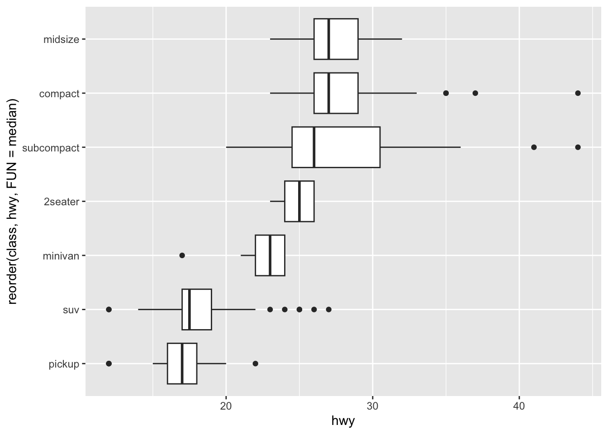
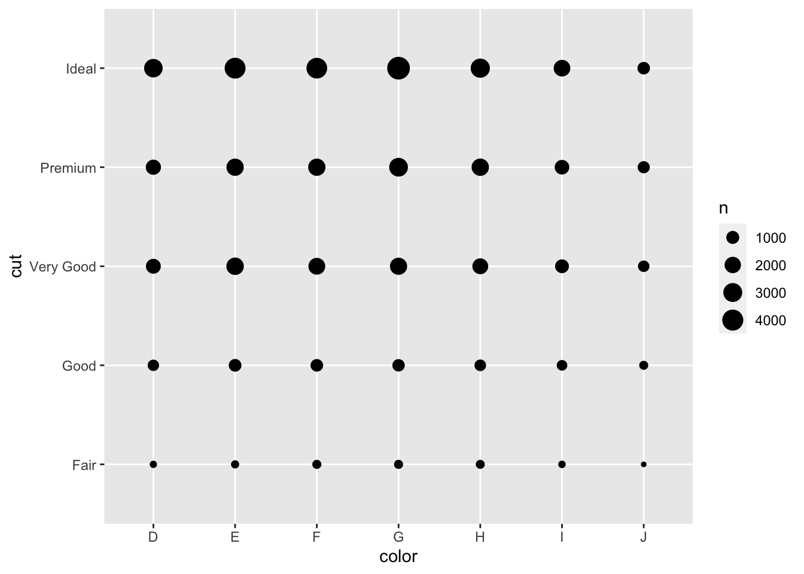
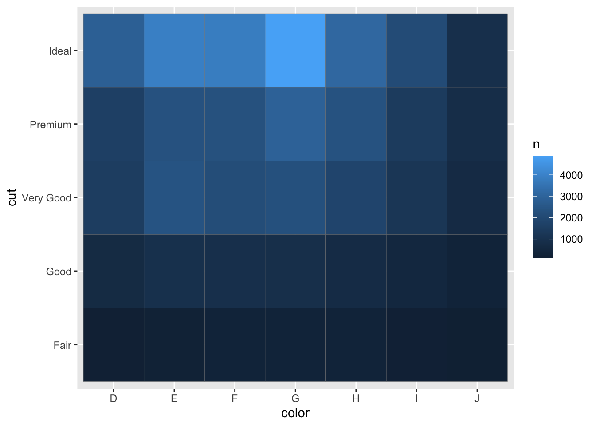

# Exploratory Data Analysis {#exploratory-data-analysis}

系统地可视化和转换探索数据，我们称为探索性数据分析或简称 EDA。EDA 是一个迭代循环，包括：

- 生成有关数据的问题。
- 通过可视化、转换和建模数据来搜索答案。
- 使用学到的知识来完善问题本身或生成新的问题。

此外请关注以下数据：

- 变量：可以测量的数量、质量或属性。
- 值：测量变量时变量的状态。变量的值可能因测量值而异。
- 观测值：在相似条件下进行的一组测量，将包含多个值，每个值都与不同的变量相关联。有时也叫数据点。
- 表格数据：一组值，每个值都与一个变量和一个观测值相关联。


```r
library(tidyverse)
```

## 绘图分析 diamonds 数据集

### 可视化分布
分类变量的分布一般用条形图，如：统计各种品质钻石的数量并绘图


```r
ggplot(data = diamonds) +
    geom_bar(mapping = aes(x = cut))
```


如果想要数据的话也可以用 [dplyr::count()](https://dplyr.tidyverse.org/reference/count.html) 统计。但事实上，所有 `count()` 能做的，`group_by` + `summarise` 都能：


```r
diamonds %>%
    count(cut_width(carat, 0.5)) # cut_width() 将数据切片分组。注意新的列名叫 cut
#> # A tibble: 11 × 2
#>    `cut_width(carat, 0.5)`     n
#>    <fct>                   <int>
#>  1 [-0.25,0.25]              785
#>  2 (0.25,0.75]             29498
#>  3 (0.75,1.25]             15977
#>  4 (1.25,1.75]              5313
#>  5 (1.75,2.25]              2002
#>  6 (2.25,2.75]               322
#>  7 (2.75,3.25]                32
#>  8 (3.25,3.75]                 5
#>  9 (3.75,4.25]                 4
#> 10 (4.25,4.75]                 1
#> 11 (4.75,5.25]                 1
```

### 绘制频率直方图

直方图一般用来检查连续变量的分布，如：统计各种克拉数的数量并绘图


```r
ggplot(data = diamonds) +
    geom_histogram(
        mapping = aes(x = carat),
        binwidth = 0.3 # 将宽度容纳（区间）增加至指定宽度
    )
```


geom_histogram() 生成的是柱形图，但如果你想要叠加多个数据的话，更推荐能生成线条图的 geom_freqpoly()：


```r
ggplot(data = diamonds, mapping = aes(x = carat, colour = cut)) +
    geom_freqpoly(binwidth = 0.1)
```


想要数据的话使用 [dplyr::count()](https://dplyr.tidyverse.org/reference/count.html) 和 [ggplot2::cut_width()](https://ggplot2.tidyverse.org/reference/cut_interval.html) 计算：


```r
diamonds %>%
    count(cut_width(carat, 0.5))
#> # A tibble: 11 × 2
#>    `cut_width(carat, 0.5)`     n
#>    <fct>                   <int>
#>  1 [-0.25,0.25]              785
#>  2 (0.25,0.75]             29498
#>  3 (0.75,1.25]             15977
#>  4 (1.25,1.75]              5313
#>  5 (1.75,2.25]              2002
#>  6 (2.25,2.75]               322
#>  7 (2.75,3.25]                32
#>  8 (3.25,3.75]                 5
#>  9 (3.75,4.25]                 4
#> 10 (4.25,4.75]                 1
#> 11 (4.75,5.25]                 1
```

### 异常数据（杂质）
异常值是超出正常范围的观察值。产生原因有时只是单纯的数据输入错误，但同样也很可能表明着新的重要科学。

例如这里用 y 列做研究：


```r
ggplot(diamonds) +
    geom_histogram(mapping = aes(x = y), binwidth = 0.5)
```


你会发现它们大多收缩成一团，而一些可疑的值明显影响了整个数据。

为了看到那些不寻常发值，我们使用 coord_cartesian() 将区别放大化：


```r
ggplot(diamonds) +
    geom_histogram(mapping = aes(x = y), binwidth = 0.5) +
    coord_cartesian(ylim = c(0, 50)) # 将 y 轴放大化直到区间 0 ~ 50
```


当然这个函数也是有 xlim 参数的，同理。

有 3 个与众不同的值出现了！分别为 0、~30、~60。我们把它们提取出来：


```r
unusual <- diamonds %>%
    filter(y < 3 | y > 20) %>%
    select(price, x, y, z) %>%
    arrange(y) %>%
    print()
#> # A tibble: 9 × 4
#>   price     x     y     z
#>   <int> <dbl> <dbl> <dbl>
#> 1  5139  0      0    0   
#> 2  6381  0      0    0   
#> 3 12800  0      0    0   
#> 4 15686  0      0    0   
#> 5 18034  0      0    0   
#> 6  2130  0      0    0   
#> 7  2130  0      0    0   
#> 8  2075  5.15  31.8  5.12
#> 9 12210  8.09  58.9  8.06
```

这些值带着明显的伦理问题和常理性错误。而我们也最好是在没有异常值的情况下进行分析。如果它们对结果的影响很小，并且我们尚且无法弄清楚它们存在的原因，那么用缺失的值（NA）替换它们是合理的。但如果它们对我们的结果有实质性影响，则不应当无缘无故地放弃它们。

我们需要找出导致它们的原因（如数据输入错误），并合理地处理这些异常数据。

### 处理异常数据

法一：删除含异常值的整行


```r
diamonds_new <- diamonds %>%
    filter(between(y, 3, 20)) # 新建数据集过滤掉杂质
```

法二：将异常值替换为 NA （推荐）


```r
diamonds_new <- diamonds %>%
    # 非常类似于 C 语言中的 xx?xx:xx 。如果 y 在 3 到 20 间则保持，否则返回 NA
    # 此外 dplyr::case_when() 有着近乎相同的功能
    mutate(y = ifelse(y > 3 & y < 20, y, NA))
```

但事实上，如果数据含有 NA，ggplot 绘图会发出警告并将相应数据剔除不会展示出来：


```r
ggplot(data = diamonds_new, mapping = aes(x = x, y = y)) +
    geom_point()
#> Warning: Removed 9 rows containing missing values (geom_point).
```


我们应该手动移除带 NA 的无效数据：


```r
ggplot(data = diamonds_new, mapping = aes(x = x, y = y)) +
    geom_point(na.rm = TRUE)
```

## 绘图统计 flights 数据集


```r
nycflights13::flights %>%
    mutate(
        cancelled = is.na(dep_time), # 如果数据是 NA 就表示航班取消了
        sched_hour = sched_dep_time %/% 100, # 国际计时除 100 商得到小时
        sched_min = sched_dep_time %% 100, # 国际计时除 100 取余得到分钟
        sched_dep_time = sched_hour + sched_min / 60 # 按照我们习惯转换成正常的分钟数
    ) %>%
    # freqpoly 非常适合折线图效果。对应的柱状图是 histogram
    # binwidth 通常会用来描述线或柱的精度。精度不足的部分会用平均值模糊化替代
    ggplot(mapping = aes(sched_dep_time)) +
    geom_freqpoly(mapping = aes(color = cancelled), binwidth = 1 / 4)
```


但这样的图表并不友好，因为未取消的航班比取消的多得多而不方便观察分析细节。

## 绘图统计 diamonds 数据集

### 连续变量多类绘图

#### 频率多边形

正如前面的频率多边形那样，我们通常需要观察按不同类别的连续变量的分布直方图。所以我们采用频率多边形来展示：


```r
ggplot(data = diamonds, mapping = aes(x = price)) +
    geom_freqpoly(mapping = aes(colour = cut), binwidth = 500)
```


但不同类别之间的数据差异依然相对明显，一些相对 “小得多” 的类别的形状难以被观察到。使用柱状图可以明显看到各个种类计数差异巨大：


```r
ggplot(diamonds) +
    geom_bar(mapping = aes(x = cut))
```


因此我们需要修改 y 轴的内容。我们将不显示计数，而是显示密度（使其标准化），以便每个频率多边形围成的面积正好为 1：


```r
ggplot(data = diamonds, mapping = aes(x = price, y = ..density..)) +
    geom_freqpoly(mapping = aes(colour = cut), binwidth = 500)
```


实际结果令人震惊！品质最差钻石却有着最高的平均价格！（UC：明天来上班）这个图中有很多有趣的现象，我们将在后面的学习中继续做深度挖掘。

#### 箱形图（箱线图）

箱线图是一种在统计学家中流行的值分布的视觉速记。其元素组成包括：

- 盒子中间：中位数
- 盒子两头：25% 和 75%，也称为四分位距（两头距离长度称作 IQR）
- 盒子两头延伸的细线：从盒子两头算起不超过 IQR 的 1.5 倍的最小和最大值
- 盒子两头远处的点：超过 IQR 的 1.5 倍的异常值


```r
ggplot(data = diamonds, mapping = aes(x = cut, y = price)) +
    geom_boxplot()
```


箱线图的信息展示会比频率多边形要紧凑得多，更利于我们比较。它支持了一个违反直觉的发现，即质量更好的钻石明显更便宜！

### 关于变量排序 reorder()

像 cut 这样的变量可能还有一个较好的默认排序，但事实上我们遇到的很多数据集可能没有这么好，需要重新排序。[reorder()](https://rdrr.io/r/stats/reorder.factor.html) 可以帮你做到。如 mpg 数据集的 class：


```r
ggplot(data = mpg, mapping = aes(x = class, y = hwy)) +
    geom_boxplot()
```


为了使趋势更容易看到，我们可以根据 hwy 的“值” 重新排序：


```r
ggplot(data = mpg) +
    geom_boxplot(mapping = aes(
        # reorder 排序，对 class 根据对应的 hwy 值进行排序, median 用来确认函数是否具有返回值
        x = reorder(class, hwy, FUN = median),
        y = hwy
    )) +
    coord_flip() # xy 轴交换，方便展示长变量名
```



### 两个分类变量

#### 交点图
查看颜色与质量的关系：


```r
ggplot(data = diamonds_new) +
    # geom_count 用来通过显示点的大小展示数据大小（次数、频率）
    geom_count(mapping = aes(x = color, y = cut))
```



#### 色砖图


```r
diamonds_new %>%
    count(color, cut) %>% # 这里只能手动计数，但不需要 group_by
    ggplot(mapping = aes(x = color, y = cut)) +
    # 注意这里的 color 只是边框颜色
    geom_tile(mapping = aes(fill = n), color = "grey50")
```



注意仅求数据可以用 count() 实现：

```
diamonds %>%
    count(color, cut)
```

### 两个连续变量

#### 二维装箱
可视化两个连续变量之间协变量的一种好方法就是使用绘制散点图。如查看质量与价格的关系：


```r
ggplot(data = diamonds) +
    geom_point(mapping = aes(x = carat, y = price))
```


散点图的点开始过度绘制，并密集堆积成均匀黑色的区域（如上所述）。一种解决方法是增加透明度：


```r
ggplot(data = diamonds_new) +
    geom_point(mapping = aes(x = carat, y = price), alpha = 1 / 100)
```


```r
# 对于非常大的数据集，使用透明度可能具有挑战性。一种解决方案是使用二维装箱
# 通过方形小色块（类似平均值效果）来模糊数据
ggplot(data = diamonds_new) +
    geom_bin2d(mapping = aes(x = carat, y = price))
```


```r
# 或者使用六边形小块（需要安装包 hexbin）
#* install.packages("hexbin")
ggplot(data = diamonds_new) +
    geom_hex(mapping = aes(x = carat, y = price))
```


#### 箱线图装箱
另一种选择是将一个连续变量装箱，使其像分类变量一样工作。所以我们使用 cut_width 分组：


```r
ggplot(data = diamonds_new, mapping = aes(x = carat, y = price)) +
    # cut_width 是 ggplot 包的函数，用来切片配合分组，将前者以后者数值划分
    geom_boxplot(mapping = aes(group = cut_width(carat, 0.3)))
```


或者在每个条柱中显示大致相同的点数。我们使用 cut_number() 分组：


```r
ggplot(data = diamonds_new, mapping = aes(x = carat, y = price)) +
    geom_boxplot(mapping = aes(group = cut_number(carat, 20)))
```


