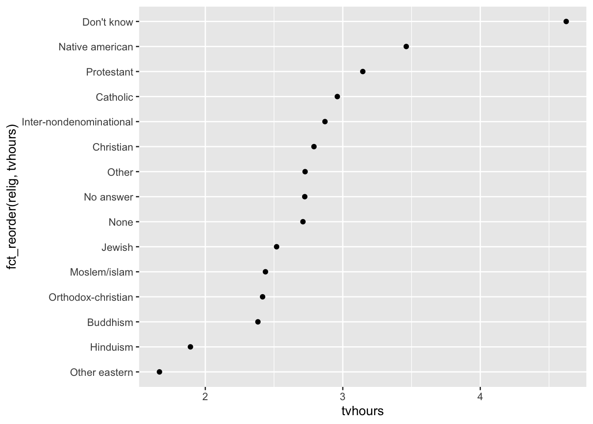
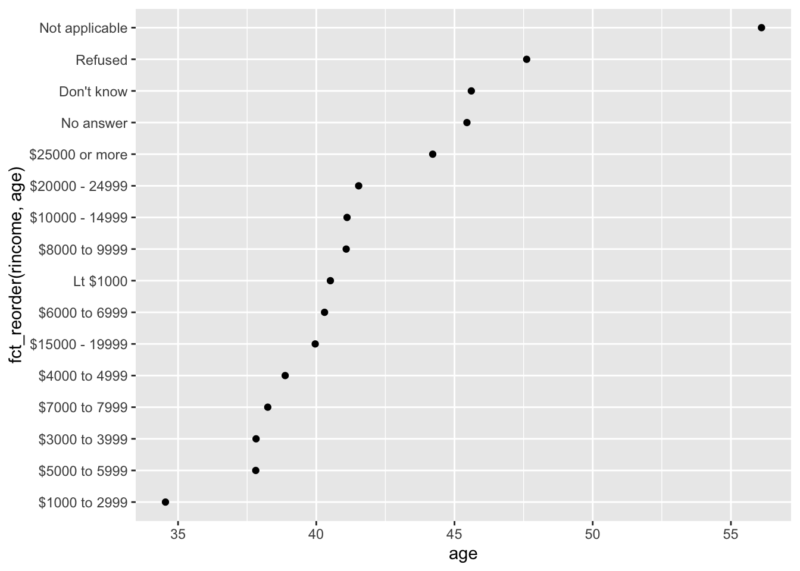
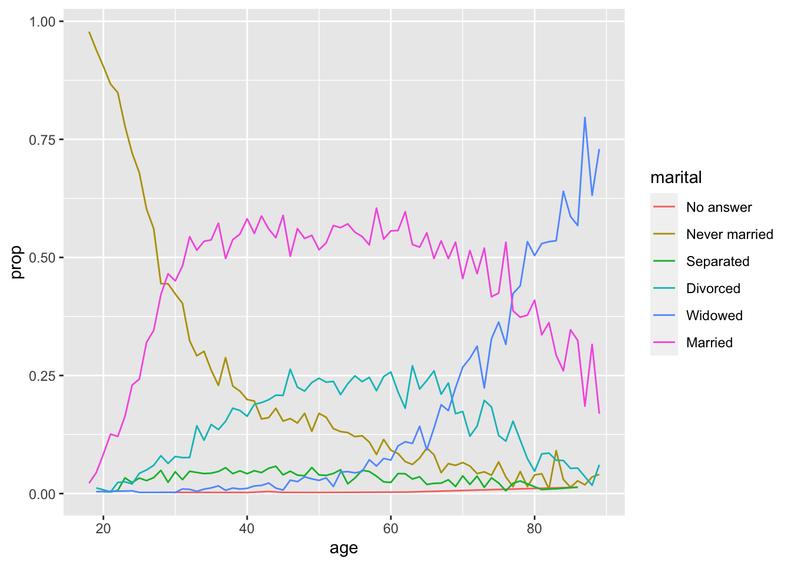
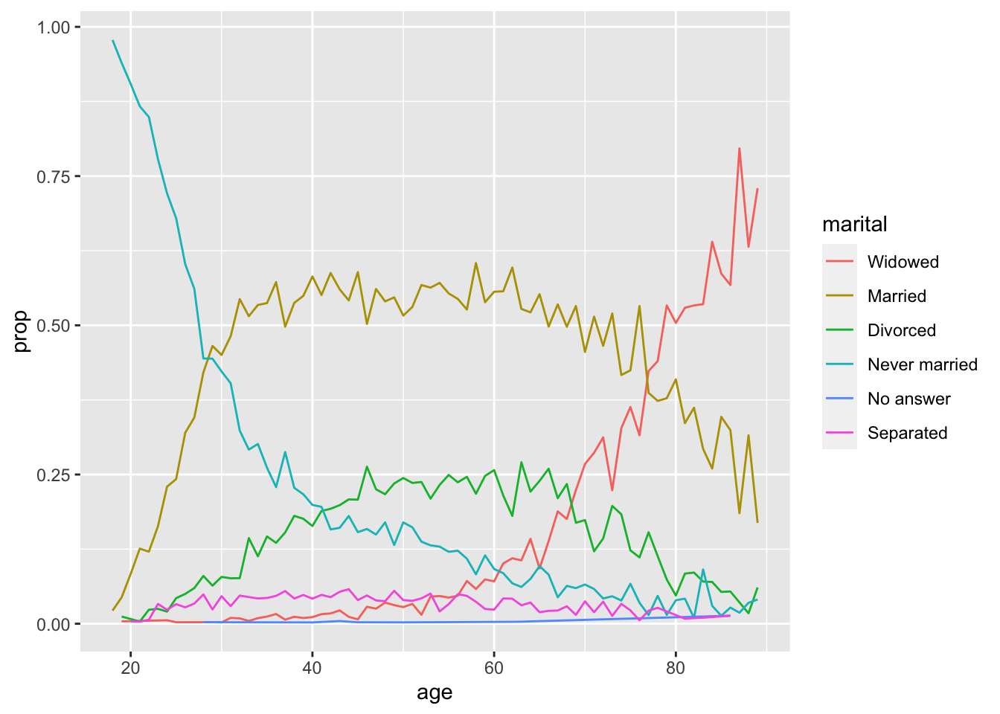

# Factors {#factors}

在 R 中，因子常常用于处理类别变量，即一系列的对于固定且已知可能值的组别变量。同样的，想要以非字母顺序显示字符向量时，它们也同样很有用。


```r
library(tidyverse)
```

## 创建因子

假设我们有一个包含月份的向量 `x1`：


```r
x1 <- c("Dec", "Apr", "Jan", "Mar")
```

现在我们要用来测试因子。要求要检查月份是否正确，排序是否有意义：


```r
# 创建一个初始向量，并保证它的内容和顺序是有意义的
month_levels <- c(
  "Jan", "Feb", "Mar", "Apr", "May", "Jun",
  "Jul", "Aug", "Sep", "Oct", "Nov", "Dec"
)

# 创建将 x1 “因子化” 的向量 y1
y1 <- factor(x1, levels = month_levels)
y1
#> [1] Dec Apr Jan Mar
#> Levels: Jan Feb Mar Apr May Jun Jul Aug Sep Oct Nov Dec

# 此时它的排序就是有意义的排序了
sort(y1)
#> [1] Jan Mar Apr Dec
#> Levels: Jan Feb Mar Apr May Jun Jul Aug Sep Oct Nov Dec

# 相同的，对于内容也会甄别，匹配不上的内容会返回 NA
x2 <- c("Dec", "Apr", "Jam", "Mar") # Jan 写错了
y2 <- factor(x2, levels = month_levels)
y2
#> [1] Dec  Apr  <NA> Mar 
#> Levels: Jan Feb Mar Apr May Jun Jul Aug Sep Oct Nov Dec
```

对于匹配不上的内容，我们可以使用 [`readr::parse_factor()`](https://readr.tidyverse.org/reference/parse_factor.html) 替换 `factor()` 使其强制报错。

而 `levels` 的省略则会使 levels 参数设置成因子化的向量本身。

## 对 gss_cat 数据集研究

接下来我们将重点研究 [`forcats::gss_cat`](https://forcats.tidyverse.org/reference/gss_cat.html) 数据集。这是一份来自 [一般性社会调查](http://gss.norc.org/) 的数据样本，是由芝加哥大学独立研究机构 NORC 进行的一项长期的美国调查。该调查包含了数千个问题，因此我们将选择几个问题，用于说明我们在处理因子时可能会遇到的一些常见挑战。


```r
gss_cat
#> # A tibble: 21,483 × 9
#>     year marital         age race  rincome        partyid    relig denom tvhours
#>    <int> <fct>         <int> <fct> <fct>          <fct>      <fct> <fct>   <int>
#>  1  2000 Never married    26 White $8000 to 9999  Ind,near … Prot… Sout…      12
#>  2  2000 Divorced         48 White $8000 to 9999  Not str r… Prot… Bapt…      NA
#>  3  2000 Widowed          67 White Not applicable Independe… Prot… No d…       2
#>  4  2000 Never married    39 White Not applicable Ind,near … Orth… Not …       4
#>  5  2000 Divorced         25 White Not applicable Not str d… None  Not …       1
#>  6  2000 Married          25 White $20000 - 24999 Strong de… Prot… Sout…      NA
#>  7  2000 Never married    36 White $25000 or more Not str r… Chri… Not …       3
#>  8  2000 Divorced         44 White $7000 to 7999  Ind,near … Prot… Luth…      NA
#>  9  2000 Married          44 White $25000 or more Not str d… Prot… Other       0
#> 10  2000 Married          47 White $25000 or more Strong re… Prot… Sout…       3
#> # … with 21,473 more rows
```

先睹为快！我们先画个 ggplot 图来康康：


```r
ggplot(gss_cat, aes(race)) +
  geom_bar() +
  scale_x_discrete(drop = FALSE) # 对 x 轴进行调整：禁止丢弃没有数据的统计分类
```


## 修改因子顺序

毫无疑问，在可视化中横向更改因子的顺序通常很有用。如我们要探索不同宗教流派每天花在看电视上的平均小时数：


```r
relig_summary <- gss_cat %>%
  group_by(relig) %>%
  summarise(
    age = mean(age, na.rm = TRUE), # 平均年龄
    tvhours = mean(tvhours, na.rm = TRUE), # 平均看电视时长
    n = n() # 流派人数
  )

ggplot(relig_summary, aes(tvhours, relig)) +
  geom_point()
```


可惜，我们很难解释这个图的内在逻辑，因为我们完全没有一个没有整体模式。我们可以使用 `fct_reorder()` 函数，以 `relig` 作为参考来改进它。注意这个函数需要三个参数：

- `f`：想要修改其顺序的因子。
- `x`：用于重新排序的数字参考向量。
- `fun`：如果 `f` 的每个值都有多个对应的 `x` 值，则使用该函数（缺省值为 median）。


```r
ggplot(
  relig_summary,
  # 以 tvhours 为横坐标，以 针对 tvhours 排序过的 relig 为纵坐标
  aes(tvhours, fct_reorder(relig, tvhours))
) +
  geom_point()
```



重新排序后可以更清楚地看到，流派为 “不知道” 的人看电视时间通常要比其他人多得多，而印度教和其他东方宗教看电视时间要少很多。初步判断可能为，没有流派倾向的人更随性生活更丰富多彩，而印度教或东方宗教的人可能买不起电视。

不过还是建议不要过分地在 ggplot 表达式里塞一些奇奇怪怪的处理。如果你要进行更复杂的转换，请使用 `mutate`。


```r
relig_summary %>%
  mutate(relig = fct_reorder(relig, tvhours)) %>%
  ggplot(aes(tvhours, relig)) +
  geom_point()
```

如果我们创建一个类似的图，看看不同年龄在报告上的平均收入水平是如何变化的呢？


```r
rincome_summary <- gss_cat %>%
  group_by(rincome) %>%
  summarise(
    age = mean(age, na.rm = TRUE),
    tvhours = mean(tvhours, na.rm = TRUE),
    n = n()
  )

ggplot(rincome_summary, aes(age, fct_reorder(rincome, age))) +
  geom_point()
```



好家伙。规律有了，但收入因子的顺序乱了。还是将收入按理想顺序排排吧：


```r
# 将 “Not applicable” 不适用分类优先级提到最高。因为他们的收入甚至还满足不了这个统计的最低标准
ggplot(rincome_summary, aes(age, fct_relevel(rincome, "Not applicable"))) +
  geom_point()
```


当使用 `plot.fct_reorder2()` 为因子重新排序时，这样的另一种类型的重新排序非常有用。这使得情节更容易阅读，因为线条颜色与图例相符，非常便于对照观察。


```r
by_age <- gss_cat %>%
  filter(!is.na(age)) %>% # 剔除 age 为 NA 的行数据
  count(age, marital) %>% # 统计不同年龄、婚姻的人数数据
  group_by(age) %>%
  mutate(prop = n / sum(n)) # 以年龄分组，计算不同婚姻状况占该年龄人数的比例

ggplot(by_age, aes(age, prop, colour = marital)) +
  geom_line(na.rm = TRUE)
```



```r

ggplot(by_age, aes(age, prop, colour = fct_reorder2(marital, age, prop))) +
  geom_line() +
  labs(colour = "marital")
```



## 编辑因子

比更改级别顺序更强大的自然是更改其值。这使您可以阐明用于发布的标签，以及用于高级显示的折叠级别。最通用和最强大的工具便是 `fct_recode()`，它允许我们重新编码或更改每个级别的值。如我们取`gss_cat$partyid`：


```r
gss_cat %>% count(partyid)
#> # A tibble: 10 × 2
#>    partyid                n
#>    <fct>              <int>
#>  1 No answer            154
#>  2 Don't know             1
#>  3 Other party          393
#>  4 Strong republican   2314
#>  5 Not str republican  3032
#>  6 Ind,near rep        1791
#>  7 Independent         4119
#>  8 Ind,near dem        2499
#>  9 Not str democrat    3690
#> 10 Strong democrat     3490

# 注意用词的机械性和可复用性，我们对其进行修改：
gss_cat %>%
  mutate(partyid = fct_recode(partyid,
    "Republican, strong"    = "Strong republican",
    "Republican, weak"      = "Not str republican",
    "Independent, near rep" = "Ind,near rep",
    "Independent, near dem" = "Ind,near dem",
    "Democrat, weak"        = "Not str democrat",
    "Democrat, strong"      = "Strong democrat"
  )) %>%
  count(partyid)
#> # A tibble: 10 × 2
#>    partyid                   n
#>    <fct>                 <int>
#>  1 No answer               154
#>  2 Don't know                1
#>  3 Other party             393
#>  4 Republican, strong     2314
#>  5 Republican, weak       3032
#>  6 Independent, near rep  1791
#>  7 Independent            4119
#>  8 Independent, near dem  2499
#>  9 Democrat, weak         3690
#> 10 Democrat, strong       3490

# 同理，合并操作同样可行：
gss_cat %>%
  mutate(partyid = fct_recode(partyid,
    "Republican, strong"    = "Strong republican",
    "Republican, weak"      = "Not str republican",
    "Independent, near rep" = "Ind,near rep",
    "Independent, near dem" = "Ind,near dem",
    "Democrat, weak"        = "Not str democrat",
    "Democrat, strong"      = "Strong democrat",
    "Other"                 = "No answer",
    "Other"                 = "Don't know",
    "Other"                 = "Other party"
  )) %>%
  count(partyid)
#> # A tibble: 8 × 2
#>   partyid                   n
#>   <fct>                 <int>
#> 1 Other                   548
#> 2 Republican, strong     2314
#> 3 Republican, weak       3032
#> 4 Independent, near rep  1791
#> 5 Independent            4119
#> 6 Independent, near dem  2499
#> 7 Democrat, weak         3690
#> 8 Democrat, strong       3490
```

