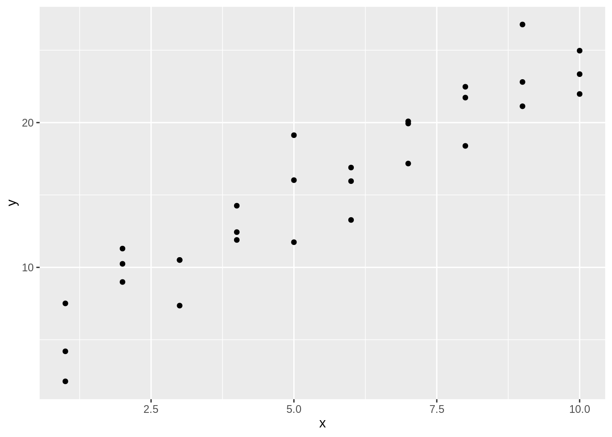
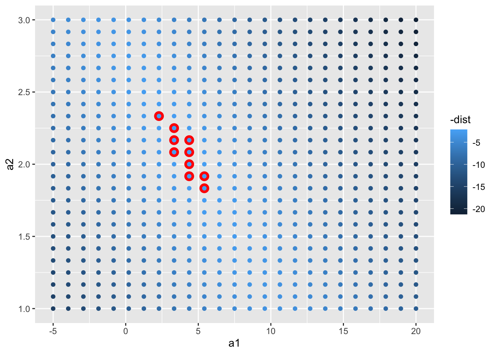
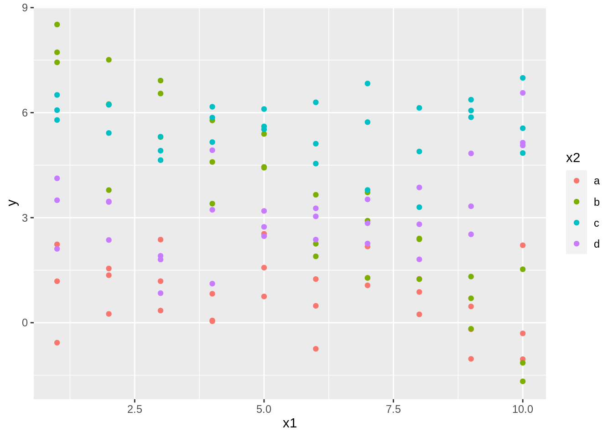
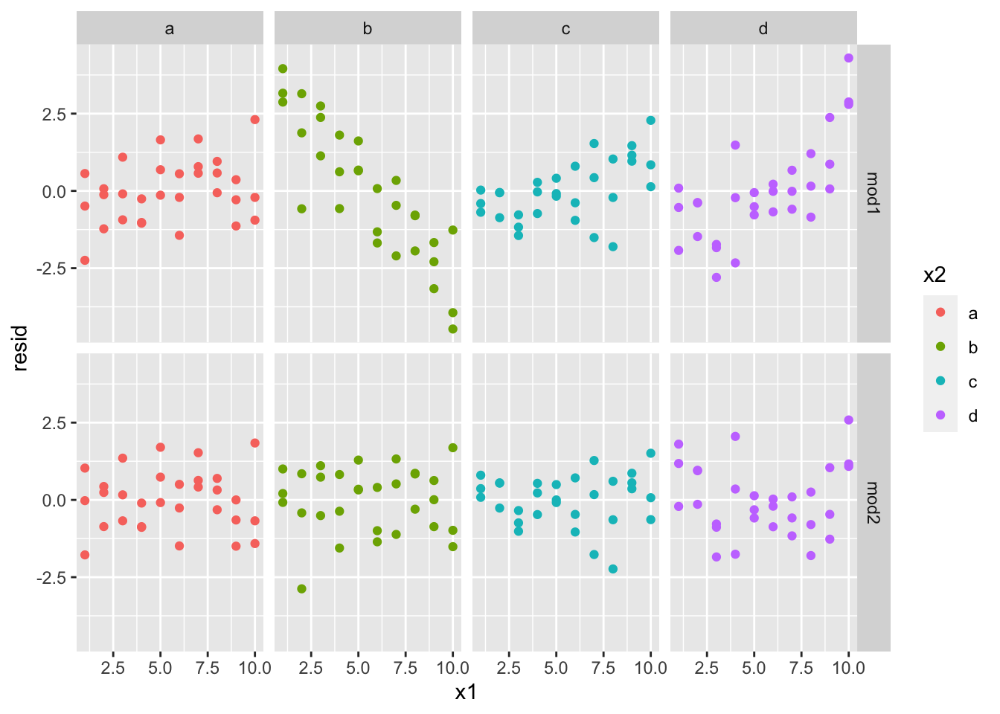
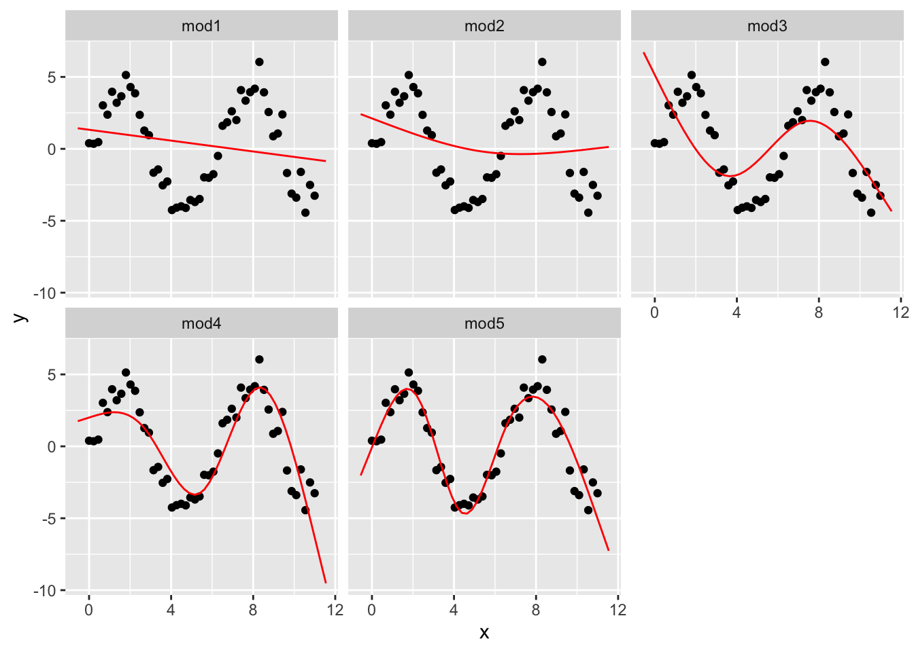

# Model basics {#model-basics}

模型由两部分组成：
- 定义一系列模型，这些模型表示要捕获的精确但通用的模式。
- 通过从最接近数据集中查找模型来生成拟合模型。这将采用通用模型系列，并使其具体化。


```r
library(tidyverse)
library(modelr)
options(na.action = na.warn)
```

## 对 sim1 模型研究

### 简单建立 sim1 模型


```r
ggplot(sim1, aes(x, y)) +
    geom_point()
```



由图可以发现，x 变量和 y 变量可能有明显线性关系。


```r
random_models <- tibble(
    # 随机生成 250 个上限 -20 下限 40 的 a1 向量
    a1 = runif(n = 250, min = -20, max = 40),
    # 同理随机生成 250 个上限 -5 下限 5 的 a2 向量
    a2 = runif(250, -5, 5)
)
```

如果用随机生成数据的话，模型会看起来非常糟糕：


```r
ggplot() +
    geom_abline(
        data = random_models,
        mapping = aes(intercept = a1, slope = a2), # intercept：截距，slope：斜率
        alpha = 1 / 4
    ) +
    geom_point(
        data = sim1,
        mapping = aes(x, y)
    )
```


我们希望有直线 y = a2*x + a1 来概括这个数据集的特征。所以我们创造了 model1：


```r
model1 <- function(a, data) {
    # 注意我们传入的 data 是一个数据集。这个设计的函数会针对数据集里的数据反复代入计算，最终返回一个向量
    a[1] + data$x * a[2]
}
```

试图用 a1 = 7 和 a2 = 1.5 数据来分析 sim1。这样我们得到了理想模型下对应 y 的值


```r
model1(c(7, 1.5), sim1)
#>  [1]  8.5  8.5  8.5 10.0 10.0 10.0 11.5 11.5 11.5 13.0 13.0 13.0 14.5 14.5 14.5
#> [16] 16.0 16.0 16.0 17.5 17.5 17.5 19.0 19.0 19.0 20.5 20.5 20.5 22.0 22.0 22.0
```

验证或者求得回归曲线的拟合度使我们通常采用方差，度量随机变量和其数学期望（即均值）之间的偏离程度。所以我们新建了函数来获得方差：


```r
measure_distance <- function(mod, data) {
    diff <- data$y - model1(mod, data) # diff 为 data 中实际 y 值与 model1 得到的理想 y 值的差
    sqrt(mean(diff^2)) # 返回所有 diff 平方的均值进行的开方（方差）
}
# 试图用 a1 = 7 和 a2 = 1.5 数据求得关于 sim1 的方差
measure_distance(c(7, 1.5), sim1)
#> [1] 2.665212
```

由于我们这里仅用来研究 sim1 数据集，所以这里新建函数用来提交给 sim1，方便后面 map2_dbl 处理：


```r
sim1_dist <- function(a1, a2) {
    measure_distance(c(a1, a2), sim1) # nolint
}
# 通过 mutate 新增计算得到的列 dist 并赋值回去（方差）
models <- random_models %>%
    mutate(dist = purrr::map2_dbl(a1, a2, sim1_dist))
models
#> # A tibble: 250 × 3
#>         a1     a2  dist
#>      <dbl>  <dbl> <dbl>
#>  1 -18.4   -0.699 38.6 
#>  2  36.3   -1.47  16.3 
#>  3  33.3    4.18  41.3 
#>  4  25.9   -2.63  14.2 
#>  5  32.7    0.849 22.2 
#>  6 -10.9    0.408 24.7 
#>  7   8.66  -0.362 11.4 
#>  8   0.169  1.81   5.84
#>  9  -2.40  -1.38  27.4 
#> 10  24.7   -4.64  25.3 
#> # … with 240 more rows
```

> 注意这里的 map2_dbl 会返回离散程度较小的，即拟合程度最高的。例如：


```r
df <- data.frame(
    x = c(1, 2, 5),
    y = c(5, 4, 8)
)
# 这个包的 map2_dbl 表达式相当于 pmin(df$x, df$y)
purrr::map2_dbl(df$x, df$y, min)
#> [1] 1 2 5
```

最后将实际得到的模型简单直观地展示出来：


```r
ggplot(sim1, aes(x, y)) +
    geom_point(size = 2, colour = "grey30") +
    geom_abline(
        aes(intercept = a1, slope = a2, colour = -dist), # 由 dist 反向上色，即越精确颜色越鲜亮
        data = filter(models, rank(dist) <= 10) # 不是所有线条都需要显示，这里选择 dist 排名前 10
    )
```


```r
# 将 a1 和 a2 用图表示出来（同样上色），这里选择 dist 排名前 10 来高亮显示（叠加）
ggplot(models, aes(a1, a2)) +
    geom_point(
        data = filter(models, rank(dist) <= 10), # 先画高亮部分
        size = 4, colour = "red"
    ) +
    geom_point(aes(colour = -dist))
```


事实上除了用 runif 创建随机模型外，我们还常常使用标准步长的规整矩阵数据模型来验算已知的回归模型：


```r
grid_models <- expand.grid(
    # expand.grid 用于于快速创建数据集（data frame格式）
    a1 = seq(-5, 20, length = 25), # seq 用于快速生成序列，参数分别代表起始、结束和序列长
    a2 = seq(1, 3, length = 25)
) %>%
    mutate(dist = purrr::map2_dbl(a1, a2, sim1_dist))

ggplot(grid_models, aes(a1, a2)) +
    geom_point(
        data = filter(grid_models, rank(dist) <= 10),
        size = 4, colour = "red"
    ) +
    geom_point(aes(colour = -dist))
```



同样，我们把拟合出的回归模型放到原始数据集对照，事实告诉我们拟合的效果非常好：


```r
ggplot(sim1, aes(x, y)) +
    geom_point(size = 2, colour = "grey30") +
    geom_abline(
        aes(intercept = a1, slope = a2, colour = -dist),
        data = filter(grid_models, rank(dist) <= 10)
    )
```


当然这对 a1、a2 数据是我们根据矩阵数据集拟合得到的。我们现在可以通过大致拟合度，继续细化数据。这样已知细化下去，我们终究得到拟合度极高的数据。

所以我们提出了一个名为**牛顿-拉夫森**搜索的数字最小化工具。牛顿-拉夫森工具的思想很简单：你选择一个起点，环顾四周最陡峭的斜坡。然后，你沿着斜坡滑了一点，然后一遍又一遍地重复，直到你不能再低了。

在 R 中，我们可以使用 optim() 做到这一点：


```r
best <- optim(
    par = c(0, 0), # 要优化的参数的初始值
    fn = measure_distance, # 要最小化（或最大化）的函数，所以 par 参数是要进行最小化的参数向量。它应该返回标量结果
    data = sim1
)
```

注意 optm() 将返回一个 list，其中 par 为找到的最佳参数向量，value 为参数向量对应的返回值：


```r
best$par
#> [1] 4.222248 2.051204
```

我们画图验证一下刚刚得到的 a1 和 a2。相应的，它的拟合程度也相当完美：


```r
ggplot(sim1, aes(x, y)) +
    geom_point(size = 2, colour = "grey30") +
    geom_abline(intercept = best$par[1], slope = best$par[2], colour = "blue")
```


线性模型的一般形式为 y = a_1 + a_2 * x_1 + a_3 * x_2 + ... + a_n * x_(n - 1)。在 R 里有一个专门为拟合线性模型而设计的工具 lm()。
lm() 用一种特殊的方式来指定模型，即公式。公式例如 y ~ x，lm() 将自动转换为 y = a_1 + a_2 * x 这样的函数：


```r
sim1_mod <- lm(y ~ x, data = sim1)
# 结果与预期完全一致
coef(sim1_mod) # coef() 是一个通用函数，用于从建模函数返回的对象中提取模型系数
#> (Intercept)           x 
#>    4.220822    2.051533
```

### 对 sim1 模型可视化观察分析

现在我们将通过查看模型的预测来专注于理解模型。每种类型的预测模型都需要进行预测。查看模型未捕获的内容（即从数据中减去预测值后留下的所谓残差）也很有用。我们可以用来研究剩余的更微妙的趋势。

#### 分析预测数据

为了模型的预测，我们先创建网格，其最简单的方法是使用 data_grid() 函数：


```r
grid <- sim1 %>% # 相当于对 sim1 定制对应的 x 数据集
    data_grid(x)
grid
#> # A tibble: 10 × 1
#>        x
#>    <int>
#>  1     1
#>  2     2
#>  3     3
#>  4     4
#>  5     5
#>  6     6
#>  7     7
#>  8     8
#>  9     9
#> 10    10
```

接下来我们开始预测。请注意 sim1_mod 来自之前 lm() 函数生成的代码：


```r
#> sim1_mod <- lm(y ~ x, data = sim1)
predictions <- grid %>%
    add_predictions(sim1_mod)
predictions
#> # A tibble: 10 × 2
#>        x  pred
#>    <int> <dbl>
#>  1     1  6.27
#>  2     2  8.32
#>  3     3 10.4 
#>  4     4 12.4 
#>  5     5 14.5 
#>  6     6 16.5 
#>  7     7 18.6 
#>  8     8 20.6 
#>  9     9 22.7 
#> 10    10 24.7
```

最后绘制预测结果：


```r
ggplot(sim1, aes(x)) +
    geom_point(aes(y = y)) +
    geom_line(aes(y = pred), data = predictions, colour = "red", size = 1)
```


#### 分析残差

残差是我们的预测值与实际值之间的距离：


```r
residuals <- sim1 %>%
    # 注意这里使用的参数是 sim1，因为我们需要原始数据集才能发现残差
    add_residuals(sim1_mod) # 用法与 add_predictions() 非常相似
residuals
#> # A tibble: 30 × 3
#>        x     y    resid
#>    <int> <dbl>    <dbl>
#>  1     1  4.20 -2.07   
#>  2     1  7.51  1.24   
#>  3     1  2.13 -4.15   
#>  4     2  8.99  0.665  
#>  5     2 10.2   1.92   
#>  6     2 11.3   2.97   
#>  7     3  7.36 -3.02   
#>  8     3 10.5   0.130  
#>  9     3 10.5   0.136  
#> 10     4 12.4   0.00763
#> # … with 20 more rows
```

最后绘制残差关于 x 的图：


```r
ggplot(residuals, aes(resid)) +
    # geom_freqpoly 即频率多边形，非常适合模糊化地绘制表现一个向量的数据的大小和出现次数
    geom_freqpoly(binwidth = 0.5)
```


```r

# 或者加入数据 x 来看到更多的数据。很容易发现它的分布非常完美：
ggplot(residuals, aes(x, resid)) +
    geom_ref_line(h = 0) + # 调整基线为 0 而不是最小
    geom_point(aes(colour = -abs(resid)))
```


## 对 sim2 模型研究

### 关于 model_matrix()

要想提取关键自定义变量的值，我们可以使用 model_matrix() 函数。如：


```r
df <- tribble(
    ~y, ~x1, ~x2,
    4, 2, 5,
    5, 1, 6
)
model_matrix(df, y ~ x1)
#> # A tibble: 2 × 2
#>   `(Intercept)`    x1
#>           <dbl> <dbl>
#> 1             1     2
#> 2             1     1

# 如果添加其他变量：
model_matrix(df, y ~ x1 + x2)
#> # A tibble: 2 × 3
#>   `(Intercept)`    x1    x2
#>           <dbl> <dbl> <dbl>
#> 1             1     2     5
#> 2             1     1     6

# R 将截距添加到模型的方式是直接填充名为截距的列（当然这个列填充前的值是没有意义的）。
# 默认添加。如果不需要，使用 “-1” 命令显式删除它：
model_matrix(df, y ~ x1 + x2 - 1)
#> # A tibble: 2 × 2
#>      x1    x2
#>   <dbl> <dbl>
#> 1     2     5
#> 2     1     6
```

对于分类变量，尤其是分类为字符的：想象一下，你有一个 tibble 数据集，其中性别可以是男性或女性。将其转换为初始数据是没有意义的，因为不是数字 —— 你不能简单地计算它！


```r
df <- tribble(
    ~sex, ~response,
    "male", 1,
    "female", 2,
    "male", 1
)
# 可以看到函数会自动将自变量的名名为 “列” “某种值”，其数据用来表示该列数据是否是指定的 “某种值”：
model_matrix(df, response ~ sex)
#> # A tibble: 3 × 2
#>   `(Intercept)` sexmale
#>           <dbl>   <dbl>
#> 1             1       1
#> 2             1       0
#> 3             1       1
```

对于 sim2，我们可以先使用 ggplot() 进行可视化观察：


```r
ggplot(sim2) +
    geom_point(aes(x, y))
```


同理我们可以对 sim2 数据集也这样将字符串转化为初始数据并预测：


```r
mod2 <- lm(y ~ x, data = sim2) # 产生理想线性回归模型
```

注意回归模型中每个 x 的分类对应一个 “斜率”。也就是说，一个 x 的 某值在模型上只会对应一个值，即平均值：


```r
grid2 <- sim2 %>%
    data_grid(x) %>% # 产生初始数据
    add_predictions(mod2) # 依据初始数据对模型进行预测
grid2
#> # A tibble: 4 × 2
#>   x      pred
#>   <chr> <dbl>
#> 1 a      1.15
#> 2 b      8.12
#> 3 c      6.13
#> 4 d      1.91
```

我们对理想模型与原始数据叠加进行可视化：


```r
ggplot(sim2, aes(x)) +
    geom_point(aes(y = y)) +
    geom_point(data = grid2, aes(y = pred), colour = "red", size = 4)
```


## 对 sim3（分类变量）模型研究

sim3 同时包含 x1 的数值和 x2 的字母分类：


```r
ggplot(sim3, aes(x1, y)) +
    geom_point(aes(colour = x2))
```



由于并不知道 x1 和 x2 同时影响了 y 的值，我们假设了两个模型：


```r
mod1 <- lm(y ~ x1 + x2, data = sim3)
mod2 <- lm(y ~ x1 * x2, data = sim3)
```

使用 “+” 来阐述变量之间的关系时，模型将独立计算每个初始数据的效应。如 y ~ x1 + x2 被转换为 y = a_0 + a_1 * x1 + a_2 * x2。

但使用 * 来阐述时，函数将结合两者的数据去初始化模型。如 y ~ x1 * x2 被转换为 y = a_0 + a_1 * x1 + a_2 * x2 + a_12 * x1 * x2。

注意一旦使用 *，所有模型的参数都会包含在模型中。“实践出真知”，我们决定尝试同时使用两个模型计算出结果去拟合原始数据并观察：


```r
grid3 <- sim3 %>%
    data_grid(x1, x2) %>% # 由于初始值有两个，这里就需要填入两个变量来产生初始数据
    # 同时从两个模型一起运算使用 gather_prediction()，相反的，我们也有 spread_prediction()
    gather_predictions(mod1, mod2) # 会在生成的 tibble 中第一列声明使用的哪个模型得到的预期数据
grid3
#> # A tibble: 80 × 4
#>    model    x1 x2     pred
#>    <chr> <int> <fct> <dbl>
#>  1 mod1      1 a      1.67
#>  2 mod1      1 b      4.56
#>  3 mod1      1 c      6.48
#>  4 mod1      1 d      4.03
#>  5 mod1      2 a      1.48
#>  6 mod1      2 b      4.37
#>  7 mod1      2 c      6.28
#>  8 mod1      2 d      3.84
#>  9 mod1      3 a      1.28
#> 10 mod1      3 b      4.17
#> # … with 70 more rows
```

最后我们将得到的数据画图分析：


```r
ggplot(sim3, aes(x1, y, colour = x2)) +
    geom_point() +
    geom_line(data = grid3, aes(y = pred)) +
    facet_wrap(~model) # 切图分组
```


哪种模型更适合此数据？我们可以看看残差：


```r
sim3_resid <- sim3 %>%
    # 多个模型获得残差与得到预期值样，也有 gather_residuals()
    gather_residuals(mod1, mod2)

ggplot(sim3_resid, aes(x1, resid, colour = x2)) +
    geom_point() +
    # geom_ref_line(h = 0) + # 调整基线为 0 而不是最小（效果不好已注释掉）
    # 这里我们按照模型和 x2 的值切图，因为它可以更容易地看到每个组中的情况
    facet_grid(model ~ x2)
```



可以看到，mod2 的拟合度更好，残差更接近 0。

## 对 sim4（连续且相互作用）模型研究

按照之前的方法，我们建立两个模型：


```r
mod1 <- lm(y ~ x1 + x2, data = sim4)
mod2 <- lm(y ~ x1 * x2, data = sim4)

grid4 <- sim4 %>%
    data_grid(
        # 以 x1 / x2 的最大和最小为界限，生成包含五个数据的等差数列
        x1 = seq_range(x1, 5),
        x2 = seq_range(x2, 5)
    ) %>%
    gather_predictions(mod1, mod2) %>% # 对两个模型求取预期结果并合并
    print()
#> # A tibble: 50 × 4
#>    model    x1    x2   pred
#>    <chr> <dbl> <dbl>  <dbl>
#>  1 mod1   -1    -1    0.996
#>  2 mod1   -1    -0.5 -0.395
#>  3 mod1   -1     0   -1.79 
#>  4 mod1   -1     0.5 -3.18 
#>  5 mod1   -1     1   -4.57 
#>  6 mod1   -0.5  -1    1.91 
#>  7 mod1   -0.5  -0.5  0.516
#>  8 mod1   -0.5   0   -0.875
#>  9 mod1   -0.5   0.5 -2.27 
#> 10 mod1   -0.5   1   -3.66 
#> # … with 40 more rows
grid4
#> # A tibble: 50 × 4
#>    model    x1    x2   pred
#>    <chr> <dbl> <dbl>  <dbl>
#>  1 mod1   -1    -1    0.996
#>  2 mod1   -1    -0.5 -0.395
#>  3 mod1   -1     0   -1.79 
#>  4 mod1   -1     0.5 -3.18 
#>  5 mod1   -1     1   -4.57 
#>  6 mod1   -0.5  -1    1.91 
#>  7 mod1   -0.5  -0.5  0.516
#>  8 mod1   -0.5   0   -0.875
#>  9 mod1   -0.5   0.5 -2.27 
#> 10 mod1   -0.5   1   -3.66 
#> # … with 40 more rows
```

### 关于 seq_range()

实际使用上，就像 group_by 与 summarize 一样，seq_range 常常绑定 data_grid 使用：


```r
# seq_range 真的可以很轻易地生成等差数列：
seq_range(c(0.0123, 0.923423), n = 5)
#> [1] 0.0123000 0.2400808 0.4678615 0.6956423 0.9234230

# pretty 参数还可以让数据更简化
seq_range(c(0.0123, 0.923423), n = 5, pretty = TRUE)
#> [1] 0.0 0.2 0.4 0.6 0.8 1.0

# trim 参数用于收缩范围，使得生成的序列更接近中值
(x1 <- rcauchy(100)) # 生成具有柯西分布特性的随机数
#>   [1]  -0.12419456   0.60975142  50.66156711  -0.51697003   0.40855522
#>   [6]   0.85227574  -1.27552588  -9.75640572  -0.47832724   0.12362895
#>  [11]   0.72408047   0.31833515 -31.81834980   2.48096474  -0.12996802
#>  [16]   5.85915541   0.68092085   1.96591500   1.76063475  -3.29910304
#>  [21]   5.66695501   1.89963862 -14.73641739  -2.26041602  -0.46646138
#>  [26]  -1.54841637  -0.11976497   0.15263148  -2.32285347   0.89532940
#>  [31]   0.45020950  -0.09601965  -3.51583737   0.84933654   5.89270032
#>  [36]   3.76756943 -52.53555497   0.67606455  -0.87733278   5.50543393
#>  [41]   0.23129520   0.75372865 -26.64709714  -0.09309741  -0.27990494
#>  [46]  -1.78271770   1.34442325  -1.17217649   0.48871201   1.02495159
#>  [51]   0.23035808   3.50758697  -1.01971261  -1.65618568  -3.94249171
#>  [56]  -0.29539749   0.99134161   8.48813318  -0.85654247   0.78173112
#>  [61]   1.71630452  -1.85714180  -0.84338320  -7.95680183  -0.44071456
#>  [66]  88.63702242  -0.87463066   3.33453142  -2.53280753  -0.14320344
#>  [71]  12.14814087  -0.56013464  -0.57014997  -2.33343878  -0.18608169
#>  [76]  -2.61641115  -0.54860019   2.80430957  -1.13394602  -2.20432417
#>  [81]  -1.34139530  -1.68994887  -0.80519641   2.35949370   1.95865260
#>  [86]   2.02452194   1.32585469   0.56214291   0.84096339   2.39754220
#>  [91]  -4.90205706   0.19611927  -0.63565790  -6.69247614   3.70902307
#>  [96]   0.83617445   1.02031042   1.68767723  -0.47396162   3.92398054

seq_range(x1, n = 5)
#> [1] -52.53555 -17.24241  18.05073  53.34388  88.63702
seq_range(x1, n = 5, trim = 0.10) # 收缩指定范围头尾 10%
#> [1] -8.046782 -4.569878 -1.092975  2.383929  5.860833
seq_range(x1, n = 5, trim = 0.25) # 收缩指定范围头尾 25%
#> [1] -2.458044 -1.059609  0.338827  1.737263  3.135698
seq_range(x1, n = 5, trim = 0.50) # 收缩指定范围头尾 50%
#> [1] -1.14350364 -0.52500352  0.09349659  0.71199671  1.33049683

# 与之相反，expand 参数会扩增范围
x2 <- c(0, 1)

seq_range(x2, n = 5)
#> [1] 0.00 0.25 0.50 0.75 1.00
seq_range(x2, n = 5, expand = 0.10)
#> [1] -0.050  0.225  0.500  0.775  1.050
seq_range(x2, n = 5, expand = 0.25)
#> [1] -0.1250  0.1875  0.5000  0.8125  1.1250
seq_range(x2, n = 5, expand = 0.50)
#> [1] -0.250  0.125  0.500  0.875  1.250
```

### 对 sim4 模型可视化绘图

和之前一样，我们对 sim4 的两个模型进行可视化绘图。


```r
ggplot(grid4, aes(x1, x2)) +
    geom_tile(aes(fill = pred)) + # 这种砖块图非常便于观察拟合度
    facet_wrap(~model)
```


x1 与 x2 似乎存在某种明显的关系！我们尝试继续深入观察：


```r
p <- list()
p[[1]] <- ggplot(grid4, aes(x1, pred, colour = x2, group = x2)) +
    geom_line() +
    facet_wrap(~model)
p[[2]] <- ggplot(grid4, aes(x2, pred, colour = x1, group = x1)) +
    geom_line() +
    facet_wrap(~model)
library(grid)
grid.newpage() # 新建布局包
pushViewport(viewport(layout = grid.layout(2, 1))) # 设置 2x1 布局
print(p[[1]], vp = viewport(layout.pos.row = 1, layout.pos.col = 1))
print(p[[2]], vp = viewport(layout.pos.row = 2, layout.pos.col = 1))
```


可以看到有明显的相互作用关系！为了预测 y，我们需要同时考虑 x1 和 x2 的值。

## 对 sim5（模型转换）模型研究

因为包不自带 sim5，这里我们只能自己建（恼


```r
sim5 <- tibble(
    x = seq(0, 3.5 * pi, length = 50),
    y = 4 * sin(x) + rnorm(length(x)) # 随机生成与 x 向量长度相同的向量并加上 4 倍 sin(x)
)
sim5
#> # A tibble: 50 × 2
#>        x      y
#>    <dbl>  <dbl>
#>  1 0     -0.462
#>  2 0.224  1.41 
#>  3 0.449  2.29 
#>  4 0.673  4.44 
#>  5 0.898  3.07 
#>  6 1.12   3.82 
#>  7 1.35   4.53 
#>  8 1.57   3.60 
#>  9 1.80   4.12 
#> 10 2.02   4.50 
#> # … with 40 more rows
```

### 关于 I() 和 model_matrix()（续）

我们还可以在模型公式内随意转换。例如，`log(y) ~ sqrt(x1) + x2` 将转换为 `log(y) = a_1 + a_2 * sqrt(x1) + a_3 * x2`。

如果转换涉及 `+`、`*`、`^` 或 `-`，则我们需要将其包装在 `I()` 函数中，这样 R 就不会将其视为模型规范的一部分。例如，y ~ x + I(x ^ 2) 翻译为 `y = a_1 + a_2 * x + a_3 * x^2`。如果上述情况忘记了 `I()` 指定成 `y ~ x ^ 2 + x`，R 将视为 `y ~ x * x + x`。

`x * x` 表示 x 与自身的相互作用，这与 x 效果相同。R 会自动删除冗余变量，会直接转换成 `y = a_1 + a_2 * x`。这很糟糕，毕竟这并不是你想要的效果。所以一定要注意避免！

而对于自己创立的模型，我们可以使用 model_matrix() 来准确查看拟合的方程：


```r
tb <- tribble(
    ~y, ~x,
    1, 1,
    2, 2,
    3, 3
)
model_matrix(tb, y ~ x^2 + x)
#> # A tibble: 3 × 2
#>   `(Intercept)`     x
#>           <dbl> <dbl>
#> 1             1     1
#> 2             1     2
#> 3             1     3

model_matrix(tb, y ~ I(x^2) + x)
#> # A tibble: 3 × 3
#>   `(Intercept)` `I(x^2)`     x
#>           <dbl>    <dbl> <dbl>
#> 1             1        1     1
#> 2             1        4     2
#> 3             1        9     3
```

### 关于 poly()

转换模型非常有用，因为我们可以使用它们来近似非线性函数。微积分课上我们学过泰勒定理，它告诉我们可以用无限的多项式和来近似任何平滑曲线函数。
这意味着我们也可以使用多项式函数通过拟合。

手动键入该序列很繁琐复杂，而 R 提供了一个函数：`poly()`


```r
model_matrix(tb, y ~ poly(x, 2)) # 注意这个 “2” 是 degree 参数，表示多项式的最高次数
#> # A tibble: 3 × 3
#>   `(Intercept)` `poly(x, 2)1` `poly(x, 2)2`
#>           <dbl>         <dbl>         <dbl>
#> 1             1     -7.07e- 1         0.408
#> 2             1     -7.85e-17        -0.816
#> 3             1      7.07e- 1         0.408
```

### 关于 ns()

注意 poly 生成的多项式函数同泰勒函数一样，出现了一个相对棘手的问题：在数据范围之外，多项式总是迅速接近无穷大。

所以我们剔除了另一种更安全的替代方案，即样条回归：`splines::ns()`


```r
library(splines)
model_matrix(tb, y ~ ns(x, 2))
#> # A tibble: 3 × 3
#>   `(Intercept)` `ns(x, 2)1` `ns(x, 2)2`
#>           <dbl>       <dbl>       <dbl>
#> 1             1       0           0    
#> 2             1       0.566      -0.211
#> 3             1       0.344       0.771
```

尝试可视化！我们建立了不同次数的 5 个模型：


```r
mod1 <- lm(y ~ ns(x, 1), data = sim5)
mod2 <- lm(y ~ ns(x, 2), data = sim5)
mod3 <- lm(y ~ ns(x, 3), data = sim5)
mod4 <- lm(y ~ ns(x, 4), data = sim5)
mod5 <- lm(y ~ ns(x, 5), data = sim5)

grid <- sim5 %>%
    data_grid(x = seq_range(x, n = 50, expand = 0.1)) %>% # 向外扩张 10% 生成矩阵
    # .pred 参数用来修改生成期望值列的列名
    gather_predictions(mod1, mod2, mod3, mod4, mod5, .pred = "y")

ggplot(sim5, aes(x, y)) +
    geom_point() +
    geom_line(data = grid, colour = "red") +
    facet_wrap(~model) # 以 model 分组
```



就像我们在数学中学习的泰勒公式一样，项的次数越高，其拟合性往往越好。mod5 的拟合度就明显大于其他模型。

### NA 值（缺少值）问题

如果你的数据你还有 NA 值的话，R 当然会提示你错误！


```r
df <- tribble(
    ~x, ~y,
    1, 2.2,
    2, NA,
    3, 3.5,
    4, 8.3,
    NA, 10
)
# mod <- lm(y ~ x, data = df)
#> Warning: Dropping 2 rows with missing values

# 加上 “na.action = na.exclude” 表示不包含 NA 值计算：
mod <- lm(y ~ x, data = df, na.action = na.exclude)
# 这样这个模型就只有 3 种观测值可用了：
nobs(mod) # nobs() 用于查看可观测次数
#> [1] 3
```

## 其他常见线性模型

本章只关注线性类型的模型，它们假设形式为 `y = a_1 * x1 + a_2 * x2 + ... + a_n * xn`。同样，对于线性模型的残差，它可能还有一些特性，如还可能具有正态分布。有许多模型以各种有趣的方式扩展线性模型，相对常用的有以下几种：

- 广义线性模型（Generalised Linear Models），如 `stats::glm()`。
  线性模型的数据通常是连续的，并且其残差具有正态分布。该模型对线性模型进行了扩展，甚至囊括了非连续响应（例如二进制数据或计数）。而其工作原理是基于可能性的统计去定义距离度量。
  
  有关广义线性模型（GLM）的实际运作参考：https://zhuanlan.zhihu.com/p/110387248
  
- 广义加性模型（Generalised Additive Models），如 `mgcv::gam()`。它扩展广义线性模型以包含任意光滑函数，这意味着我们可以编写诸如 `y ~ s(x)` 这样的公式。这样的模型公式将使用 y = f(x) 和 letgam，即 `gam()` 去估计该函数是什么样的。

  有关广义加性模型（GAM）的实际运作参考：https://zhuanlan.zhihu.com/p/53001283

- 惩罚线性模型（Penalised Linear Models），如 `glmnet::glmnet()`。
  该模型使得在 “惩处” 一个复杂模型的距离中添加一个 “惩处” 项（由参数向量和原点之间的距离决定）。这往往使模型可以更好地推广到来自同一人群的新数据集。

- 稳健线性模型（Robust linear models），如 `MASS::rlm()`。
  该模型用于调整与模型预期距离非常远的点的权重，使得模型对于异常值问题不那么敏感。但其代价则是在没有异常值时通常不如其他模型的拟合效果那么强。
  
  有关稳健线性模型（RLM）的实际运作参考：https://zhuanlan.zhihu.com/p/398805690

- 树模型（Trees），如 `rpart::rpart()`。
  这种模型则是以与线性模型完全不同的方式去解决问题，适合分段恒定模型，并将数据拆分多个成足够小的部分。树模型本身并不出色，但当被随机森林（Random Forests），像是 `randomForest::randomForest()`，或是梯度提升机（Gradient Boosting Machines），像是 `xgboost::xgboost()` 等多种模型聚合使用时，树模型会变得非常强大。
  
  有关随机森林（RF）的实际运作参考：https://zhuanlan.zhihu.com/p/125505067
  有关梯度提升机（GBM）的实际运作参考：https://zhuanlan.zhihu.com/p/36011508
