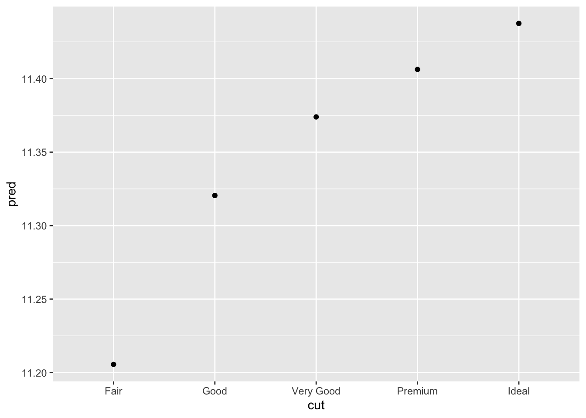
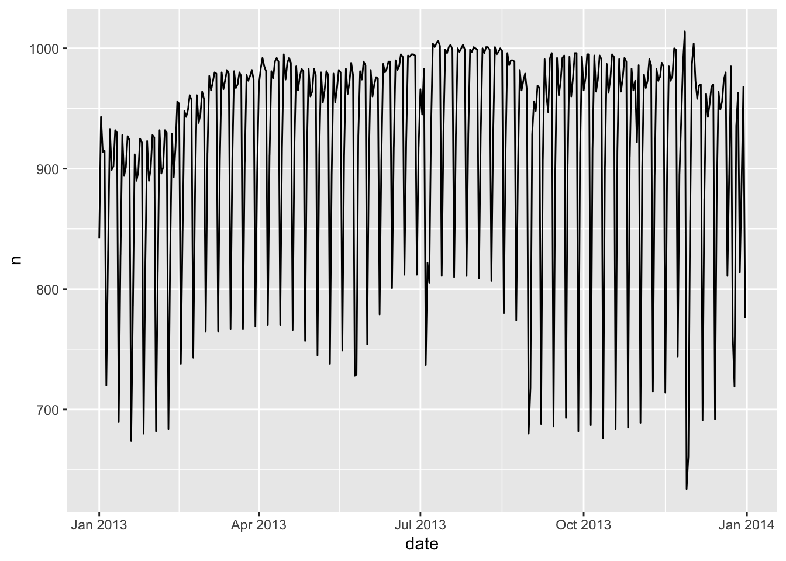
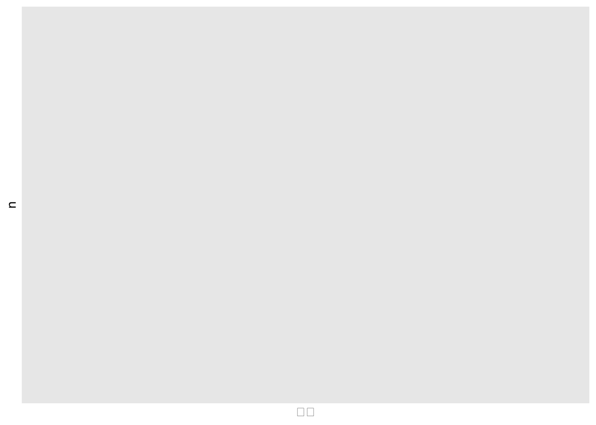
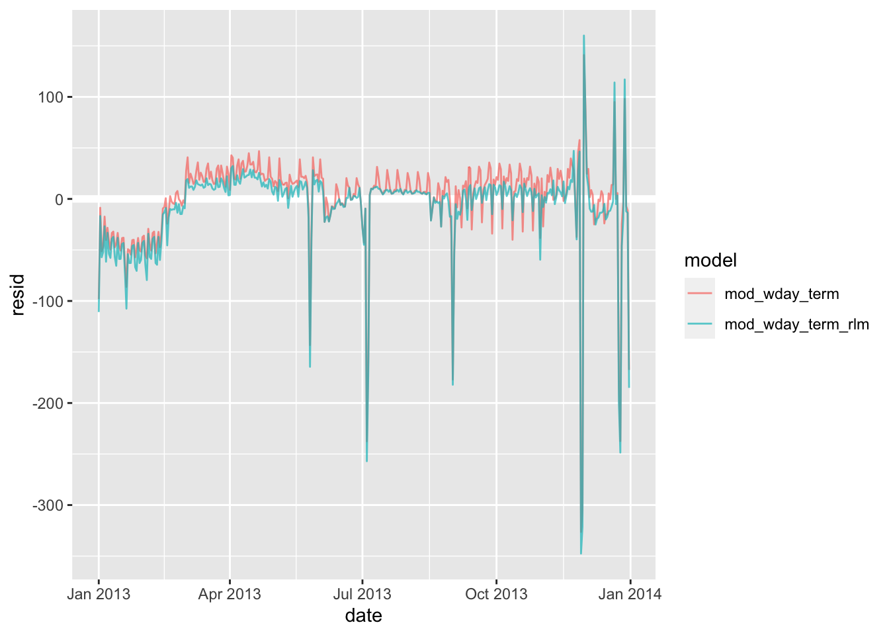

# Model building

上一章我们侧重于模拟数据集。本章将重点介绍真实数据，以及如何构建模型以便理解数据。我们可以将数据划分为模式和残差模型。注意模型建立有时不尽人意，有时建立得很好但你不知道为什么。

如果你遇到了任何困惑 —— 请不要畏惧重新开始！换个全新思路可能对你非常有用。


```r
library(tidyverse)
library(modelr)
options(na.action = na.warn)

library(nycflights13)
library(lubridate)
```

## 分析 diamonds 品质与价格反常的原因

还记得我们之前研究的奇怪现象吗？品质越差的钻石，价格越高。不只是质量，在颜色、纯净度方面都是这样表现的：


```r
ggplot(diamonds, aes(cut, price)) +
    geom_boxplot()
```


```r
ggplot(diamonds, aes(color, price)) +
    geom_boxplot()
```


```r
ggplot(diamonds, aes(clarity, price)) +
    geom_boxplot()
```


注意最差的钻石颜色是 J（微黄色），最差的纯净度是 I1（肉眼可见的杂物）。

### 重量与价格


```r
ggplot(diamonds, aes(carat, price)) +
    geom_hex(bins = 50)
```


我们决定对数据进行过滤处理：


```r
diamonds_new <- diamonds %>%
    filter(carat <= 2.5) %>% # 质量小于 2.5
    mutate(lprice = log2(price), lcarat = log2(carat)) # 对价格和质量取对数（基数为 2 的对数）

ggplot(diamonds_new, aes(lcarat, lprice)) +
    geom_hex(bins = 50)
```


通过转化，它们的关系变成了明显漂亮的线性化！我们试着创建模型去拟合它：


```r
mod_diamonds <- lm(lprice ~ lcarat, data = diamonds_new)
grid <- diamonds_new %>%
    data_grid(carat = seq_range(carat, 20)) %>% # 创建矩阵
    mutate(lcarat = log2(carat)) %>% # 矩阵生成的 carat 也需要取对数
    add_predictions(mod_diamonds, "lprice") %>% # 预测
    mutate(price = 2^lprice) # 将价格还原回去
```

最后绘制数据图：


```r
ggplot(diamonds_new, aes(carat, price)) +
    geom_hex(bins = 50) +
    geom_line(data = grid, colour = "red", size = 1)
#> Warning: Using `size` aesthetic for lines was deprecated in ggplot2 3.4.0.
#> ℹ Please use `linewidth` instead.
#> This warning is displayed once every 8 hours.
#> Call `lifecycle::last_lifecycle_warnings()` to see where this warning was
#> generated.
```


这告诉我们一些关于这些数据的有趣信息：如果我们相信我们创造的模型，那么大钻石比预期的要便宜得多。

我们来分析残差的数据：


```r
diamonds_new <- diamonds_new %>%
    add_residuals(mod_diamonds, "lresid") # 注意这里分析得到的数据是取过对数的

ggplot(diamonds_new, aes(lcarat, lresid)) +
    geom_hex(bins = 50)
```


我们决定舍弃掉价格变量，因为 lrisid 变量可能有其他参考价值：


```r
ggplot(diamonds_new, aes(cut, lresid)) +
    geom_boxplot()
```


```r
ggplot(diamonds_new, aes(color, lresid)) +
    geom_boxplot()
```


```r
ggplot(diamonds_new, aes(clarity, lresid)) +
    geom_boxplot()
```


现在我们看到了所期望的结果：钻石品质越高，其相对价格也越高。

### 推广出更复杂的模型

既然价格对数与质量对数、颜色、质量和品质都有重要关系，那我们不妨把它们都加入模型：


```r
mod_diamond_new <- lm(
    lprice ~ lcarat + color + cut + clarity,
    data = diamonds_new
)

grid <- diamonds_new %>%
    # 用 data_grid() 来创建数据越来越麻烦了。
    # 好在我们有一个叫 “.model” 的参数帮我们完成：
    data_grid(cut, .model = mod_diamond_new) %>%
    add_predictions(mod_diamond_new)
grid
#> # A tibble: 5 × 5
#>   cut       lcarat color clarity  pred
#>   <ord>      <dbl> <chr> <chr>   <dbl>
#> 1 Fair      -0.515 G     VS2      11.2
#> 2 Good      -0.515 G     VS2      11.3
#> 3 Very Good -0.515 G     VS2      11.4
#> 4 Premium   -0.515 G     VS2      11.4
#> 5 Ideal     -0.515 G     VS2      11.4

ggplot(grid, aes(cut, pred)) +
    geom_point()
```



如果模型需要我们未显式提供的变量，data_grid() 将自动使用 “典型值” 填充它们。对于连续变量，它使用中位数，分类变量使用最常见的值（如果存在并列，则使用或值）。


```r
diamonds_new <- diamonds_new %>%
    # 新的 lrisid 添加了颜色、质量和品质关系
    add_residuals(mod_diamond_new, "lresid_new")

ggplot(diamonds_new, aes(lcarat, lresid_new)) +
    geom_hex(bins = 50)
```


我们会发现有一些钻石数据的残差相当大 —— 尤其是因为取对数的关系，残差为 2 表示钻石的价格是我们预期的 4 倍。单独查看异常值通常很有用：


```r
diamonds_new %>%
    filter(abs(lresid_new) > 1) %>% # 残差绝对值大于 1
    add_predictions(mod_diamond_new) %>% # 对这些数据生成期望值对数
    mutate(pred = round(2^pred)) %>% # 对期望值反对数并取整
    select(price, pred, carat:table, x:z) %>% # 重新选取需要的数据
    arrange(price) # 按照价格排列
#> # A tibble: 16 × 11
#>    price  pred carat cut       color clarity depth table     x     y     z
#>    <int> <dbl> <dbl> <ord>     <ord> <ord>   <dbl> <dbl> <dbl> <dbl> <dbl>
#>  1  1013   264  0.25 Fair      F     SI2      54.4    64  4.3   4.23  2.32
#>  2  1186   284  0.25 Premium   G     SI2      59      60  5.33  5.28  3.12
#>  3  1186   284  0.25 Premium   G     SI2      58.8    60  5.33  5.28  3.12
#>  4  1262  2644  1.03 Fair      E     I1       78.2    54  5.72  5.59  4.42
#>  5  1415   639  0.35 Fair      G     VS2      65.9    54  5.57  5.53  3.66
#>  6  1415   639  0.35 Fair      G     VS2      65.9    54  5.57  5.53  3.66
#>  7  1715   576  0.32 Fair      F     VS2      59.6    60  4.42  4.34  2.61
#>  8  1776   412  0.29 Fair      F     SI1      55.8    60  4.48  4.41  2.48
#>  9  2160   314  0.34 Fair      F     I1       55.8    62  4.72  4.6   2.6 
#> 10  2366   774  0.3  Very Good D     VVS2     60.6    58  4.33  4.35  2.63
#> 11  3360  1373  0.51 Premium   F     SI1      62.7    62  5.09  4.96  3.15
#> 12  3807  1540  0.61 Good      F     SI2      62.5    65  5.36  5.29  3.33
#> 13  3920  1705  0.51 Fair      F     VVS2     65.4    60  4.98  4.9   3.23
#> 14  4368  1705  0.51 Fair      F     VVS2     60.7    66  5.21  5.11  3.13
#> 15 10011  4048  1.01 Fair      D     SI2      64.6    58  6.25  6.2   4.02
#> 16 10470 23622  2.46 Premium   E     SI2      59.7    59  8.82  8.76  5.25
```

似乎没有什么出人意料的数据，但可能值得花时间考虑，这是否表明我们的模型存在问题，或者数据中存在错误。

## 分析 flights 每日航班数量变化因素

按照天来看，这是一个包含 365 项的简单数据集：


```r
daily <- flights %>%
    # 同理我们还有 make_datetime，作用是将日期各因素拼接，并返回 “日期” 格式数据
    mutate(date = make_date(year, month, day)) %>%
    group_by(date) %>%
    summarise(n = n())
daily
#> # A tibble: 365 × 2
#>    date           n
#>    <date>     <int>
#>  1 2013-01-01   842
#>  2 2013-01-02   943
#>  3 2013-01-03   914
#>  4 2013-01-04   915
#>  5 2013-01-05   720
#>  6 2013-01-06   832
#>  7 2013-01-07   933
#>  8 2013-01-08   899
#>  9 2013-01-09   902
#> 10 2013-01-10   932
#> # … with 355 more rows

ggplot(daily, aes(date, n)) +
    geom_line()
```



不难发现，航班书总是呈现出周期性变化。我们接下来按星期几划分。

### 星期几对航班的影响


```r
daily <- daily %>%
    # 对指定的日期来返回星期几（label 配置项为是否要用当地语言表示,默认 FALSE 用数字表示）
    mutate(wday = wday(date, label = TRUE))
ggplot(daily, aes(wday, n)) + # 注意这里默认周末排最前
    geom_boxplot()
```


双休日的航班相对要少些，因为大多数旅行都是商务旅行。这种影响在周六尤为明显：你有时可能会在周日离开去参加周一上午的会议，但你很少在周六离开，因为你更愿意在家和家人们在一起。

消除这种影响最简单的方法是使用模型矫正。首先，我们拟合模型，并将其预测覆盖在原始数据上来可视化：


```r
mod_wday <- lm(n ~ wday, data = daily)

grid <- daily %>%
    data_grid(wday) %>%
    add_predictions(mod_wday, "n")

ggplot(daily, aes(wday, n)) +
    geom_boxplot() +
    geom_point(data = grid, colour = "red", size = 4)
```


这样，我们就把问题转化为分析残差：


```r
daily <- daily %>%
    add_residuals(mod_wday)
daily %>%
    ggplot(aes(date, resid)) +
    geom_ref_line(h = 0) + # 基线调整到 0 而不是最小
    geom_line()
```


现在，通过星期几预估模型，我们发现航班数量仍然明显偏离了预期航班数量。虽然现在我们已经消除了大部分大的每周效应，但我们仍然可以看到一些更微妙的变化：有没有一种可能，我是说可能，这个模型的变化不只是单纯的被星期几？

从6月份开始，我们的模型很是失败。为一周中的每一天绘制一条线，使原因更容易看到：


```r
ggplot(daily, aes(date, resid, colour = wday)) +
    geom_ref_line(h = 0) +
    geom_line()
```


有些线条仍然在乱飞！尤其是周六的航班数量：夏季的航班比我们预期的要多，秋季的航班则少得多。之后我们会着重分析。

这里将偏离过大的 “异常” 数据单独取出仔细研究：


```r
daily %>%
    filter(resid < -100)
#> # A tibble: 11 × 4
#>    date           n wday  resid
#>    <date>     <int> <ord> <dbl>
#>  1 2013-01-01   842 Tue   -109.
#>  2 2013-01-20   786 Sun   -105.
#>  3 2013-05-26   729 Sun   -162.
#>  4 2013-07-04   737 Thu   -229.
#>  5 2013-07-05   822 Fri   -145.
#>  6 2013-09-01   718 Sun   -173.
#>  7 2013-11-28   634 Thu   -332.
#>  8 2013-11-29   661 Fri   -306.
#>  9 2013-12-24   761 Tue   -190.
#> 10 2013-12-25   719 Wed   -244.
#> 11 2013-12-31   776 Tue   -175.
```

请注意这些日期并不是巧合。从美国公共假日角度来看，我们会发现这些数据包含元旦、美国独立日（7月4日）、感恩节和圣诞节。

而除上述个别突出的数据以外，也有一些整体性的趋势：


```r
daily %>%
    ggplot(aes(date, resid)) +
    geom_ref_line(h = 0) +
    geom_line(colour = "grey50") +
    geom_smooth(se = FALSE, span = 0.20)
#> `geom_smooth()` using method = 'loess' and formula = 'y ~ x'
```


冬季（12月至3月）的航班相对较少，而夏季（5月至9月）的航班明显更多。尽管我们只有一年的数据，没有更好地佐证这个观点。但我们可以通过思考获取潜在的解释。

### 季节性周六效应

之前我们发现仅周六在周预测模型对于全年数据中，出现明显偏差。这里专门提取进行研究：


```r
daily %>%
    filter(wday == "周六") %>%
    # 如果是英语作为 R 的语言设置的话：filter(wday == "Sat") %>%
    ggplot(aes(date, n)) +
    geom_point() +
    geom_line() +
    # 对 x 轴的缩放比例进行调整，其中数据类型为 date
    scale_x_date(
        name = "月份", # 比例尺名称
        date_breaks = "1 month", # 间隔为一个月
        date_labels = "%b" # 指定展示规范为仅显示月
    )
```


同样是周六，不同的周六反馈的数据差异巨大！很难不会引起怀疑 —— 这是由暑假引起的：

当地人们通常在夏天去度假，也不介意选择周六度假。选择这个时间段度假，很可能是因为孩子们正好在放暑假。所以我们有理由推测暑假是从6月初到8月下旬。
实际查询数据我们得到，该州在2013年的暑假安排是6月26日至9月9日。但为什么春季的周六航班比秋季多？调研得知计划秋天度假的家庭实在不太常见，因为感恩节和圣诞节假期真的已经足够长。

让我们创建一个大致包含三个学校学期的 “term” 变量，并用一个函数来验证我们的推论：


```r
term <- function(date) {
    # cut 会切割我们本有的数据集，break 确认切割点位
    cut(date,
        breaks = ymd(20130101, 20130605, 20130825, 20140101), # 创建日期向量
        labels = c("spring", "summer", "fall") # 切割后类别的命名标签
    )
}

# 通过切割获取学期标签
daily <- daily %>%
    mutate(term = term(date))

daily %>%
    filter(wday == "周六") %>%
    ggplot(aes(date, n, colour = term)) +
    geom_point(alpha = 1 / 3) +
    geom_line() +
    scale_x_date(name = "月份", date_breaks = "1 month", date_labels = "%b")
```



不同季节学期之间的断层非常明显！学生一旦处于暑假，周六出行度假的数量就会居高不下。

我们试着把这个规律推广到其他星期几：


```r
daily %>%
    ggplot(aes(wday, n, colour = term)) +
    geom_boxplot()
```


每个星期几都呈现这样的趋势：春季数据多变（由于节日，春季开头与结尾差异较大）、夏季（数据）航班偏多。周六用于暑假度假的趋势也很明显。

既然同时存在两个因素，我们不妨建立两个模型进行对比：


```r
mod_wday <- lm(n ~ wday, data = daily)
mod_wday_term <- lm(n ~ wday * term, data = daily)

daily %>%
    gather_residuals(without_term = mod_wday, with_term = mod_wday_term) %>%
    ggplot(aes(date, resid, colour = model)) +
    geom_ref_line(h = 0) +
    geom_line(alpha = 0.75)
```


其实这里就已经表现出来了，包含 term 的模型的预期效果明显优于不包含的。接下来我们将模型与实际数据对应上：


```r
grid <- daily %>%
    data_grid(wday, term) %>%
    gather_predictions(
        without_term = mod_wday,
        with_term = mod_wday_term,
        .pred = "n"
    )

ggplot(daily, aes(wday, n)) +
    geom_boxplot() +
    geom_point(data = grid, colour = "red") +
    facet_grid(term ~ model)
```


我们的模型总是在走向一个我们所期望的 “寻常态”，但很不幸元数据有许多非常突出的异常值，以至于我们的预测值与理想值相去甚远。所以我们提出了新函数 `MASS::rlm()` 来合理处理异常值。


```r
mod_wday_term_rlm <- MASS::rlm(n ~ wday * term, data = daily) # 用法与 lm() 真的很类似

daily %>%
    gather_residuals(mod_wday_term_rlm, mod_wday_term) %>%
    ggplot(aes(date, resid)) +
    geom_hline(yintercept = 0, size = 2, colour = "white") +
    geom_line(aes(colour = model), alpha = 0.7)
```



新的模型可能更容易看到长期趋势和异常值。

### 针对一年中的不同时间点

我们可以使用一个更为灵活的模型，用来捕获我们感兴趣的内容。一个简单的线性趋势是不够的，我们可以尝试使用自然样条来拟合全年的平滑曲线：


```r
library(splines) # 便于使用自然样条函数 ns()
mod <- MASS::rlm(n ~ wday * ns(date, 5), data = daily) # 最高 5 次方

daily %>%
    data_grid(
        wday, # 针对列 wday 生成新的无重复数据的基础数据列
        date = seq_range(date, n = 20) # 将 date 范围等距切割出 20 个点位
    ) %>%
    add_predictions(mod) %>%
    ggplot(aes(date, pred, colour = wday)) +
    geom_line() +
    geom_point()
```


## 关于计算变量

在我们试验多个模型和可视化效果时，最好将变量的创建捆绑到一个函数中，如：


```r
compute_vars <- function(data) {
    data %>%
        mutate(
            term = term(date),
            wday = wday(date, label = TRUE)
        )
}
# 或者将转换直接放在模型公式中：
wday2 <- function(x) wday(x, label = TRUE)
mod3 <- lm(n ~ wday2(date) * term(date), data = daily)
```

这两种方法都是合理的。但如果要画图或检查变量，显式转换可能更好。但请不要随意使用返回多个列的转换（如样条曲线）。

## 有关模型的更多信息

我们只是触及了建模表层的一些东西，也获得了一些简单通用的工具，用于改善自己的数据分析。
从简单开始是可以的！但正如所看到的那样，即使是非常简单的模型，也会对你梳理变量之间相互作用的能力产生巨大的影响。
下面有一些很棒的书籍；建模确实值得一本书，所以我强烈建议你至少读其中的任意一本：

- *Statistical Modeling: A Fresh Approach* by *Danny Kaplan*
  
  > 👉 [书本官网](http://project-mosaic-books.com/?page_id=13)（已挂，但保有 [Archive 历史版本](https://web.archive.org/web/20201207153442/http://project-mosaic-books.com/)）
  >
  > 👉 [电子版购买（亚马逊）](https://www.amazon.com/Statistical-Modeling-Approach-Project-MOSAIC-ebook/dp/B073WDBJ57/)
  >
  > 👉 [在线阅读](https://dtkaplan.github.io/SM2-bookdown/)
  >
  > 本书温和地（。？）介绍了建模，我们可以在其中并行构建直觉，数学工具和一些关于 R 的小技巧。同时这本书取代了传统的 “统计学导论” 课程，提供了一个全新的与数据科学相关的课程。
  
- *An Introduction to Statistical Learning* by *Gareth James, Daniela Witten, Trevor Hastie*
  
  > 👉 [作者官网](http://www-bcf.usc.edu/~gareth/ISL/) | [书本官网](https://www.statlearning.com/)
  >
  > 👉 电子版下载：[PDF](https://hastie.su.domains/ISLR2/ISLRv2_website.pdf) | [EPUB](https://link.springer.com/download/epub/10.1007/978-1-4614-7138-7.epub)
  >
  > 👉 [教学资源文件下载](https://www.statlearning.com/resources-second-edition)
  >
  > 本书介绍了一系列现代建模技术，统称为统计学习。
  > 要更深入地了解模型背后的数学原理，则请阅读：
  > *The Elements of Statistical Learning* by *Trevor Hastie, Robert Tibshirani, and Jerome Friedman*（电子版下载：[一代版本](https://web.stanford.edu/~hastie/Papers/ESLII.pdf) | [二代版本](http://hastie.su.domains/ElemStatLearn/printings/ESLII_print12_toc.pdf)）
  
- *Applied Predictive Modeling* by *Max Kuhn* and *Kjell Johnson*
  
  > 👉 [书本官网](http://appliedpredictivemodeling.com)
  >
  > 👉 [电子版购买（亚马逊）](https://www.amazon.com/Applied-Predictive-Modeling-Max-Kuhn/dp/1461468485?SubscriptionId=0ENGV10E9K9QDNSJ5C82&linkCode=xm2)
  >
  > 本书更多是配套于 caret 包，为应对现实生活中的预测建模挑战提供了相当丰富的实用工具。

一个可能对你有用的下载集合：[Trevor Hastie - Publications (su.domains)](https://hastie.su.domains/pub.htm)
