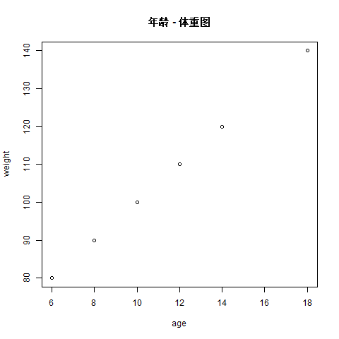

# (PART) Explore 探索 {-}

# Introduction {#explore-intro}

```{R settings, include = FALSE}
knitr::opts_chunk$set(
  comment = "#>",
  collapse = TRUE
)
```

尽快掌握数据探索的基本工具是探究语言的第一要义。数据探索的目标是生成许多有前途的潜在信息，便于以后更深入地探索它们。


- **可视化**是 R 编程的重要部分：制作优雅且信息丰富的绘图，以帮助理解数据。学习 ggplot2 绘图的基本结构，将数据转换为绘图。
- 在数据转换中，使用**关键谓词**允许我们选择重要变量、筛选出关键观察结果、创建新变量和计算摘要。
- **建模**是探索过程的重要组成部分，但这并不是当下能够弄清的，它会在以后的学习中逐渐深入。

**在工作流**中：“基础知识”、“工作流：脚本” 和 “工作流：项目”，你将学习编写和组织 R 代码的良好实践。

以下为附加内容，因为已知资料上貌似没有提到。

## 基本数据形式和函数

### 向量、矩阵与列表

创建已知或未知的空向量用于存储一系列数据（如整数、小数、字符串）。

```{R vector}
x <- vector() # 创建空向量
y <- c(1, 2) # 手动赋值
# 在 R 中，我们可以使用 “:” 来创建序列填充
z <- c(1:3) # 这里其实等价于 1, 2, 3
```

矩阵有点像我们学的表格，这种数据结构很类似于其它语言中的二维数组。注意使用 `t()` 可以行列互换。


```{R t()}
rownames <- c("row1", "row2", "row3", "row4")
colnames <- c("col1", "col2", "col3")
m <- matrix(
    data = c(3:14), #
    nrow = 4, # 设置行数。如果不知道数据有多少其实可以不设置
    ncol = 3, # 设置列宽
    byrow = TRUE, # 设置为 TRUE 即按行排列，反之则按列排
    dimnames = list(rownames, colnames) # 设置行和列的标题，默认为 NULL
)
m
t(m)
```

列表使用 `list()` 创建。一个列表里可以随意放置向量里能放置的所有元素，甚至是一个向量、一个矩阵。

```{R list(), eval = FALSE}
list_data <- list(
    "google",
    matrix(c(1, 2, 3, 4, 5, 6), nrow = 2),
    123.1,
    c(1:5)
)

# 读取元素
list_data[[1]] # 注意中括号应该用两层来获取对应元素。但如果只用一层，R 会自动识别并修正
names(list_data) <- c("Sites", "Numbers", "Lists") # 使用 names() 来赋值名称
list_data$Sites # 有名称后可以用 $xx 来读取对应的列元素

# 添加 / 更新元素
list_data[5] <- "新元素"

# 删除元素
list_data[4] <- NULL

# 合并 / 转换列表
num_list <- list(1, 2)
merged_list <- c(num_list, list_data) # 合并
unlist(num_list) # 转换列表为向量
```

### 基本函数

数据集如下：

```{R creat data}
age <- c(10, 12, 14, 6, 8, 18)
weight <- c(100, 110, 120, 80, 90, 140)
```

数学中一些常用的计算函数

```{R calculate}
5 %% 3 # 求余数
5 %/% 3 # 求模

mean(age) # 求平均值
sd(age) # 求标准差
cor(age, weight) # 求相关度，数值在 -1 到 1，其中 1 是绝对正相关，0 是完全不相关，-1 是绝对负相关
lm(age ~ weight) # 求两者构成的回归直线斜率（注意波浪号连接）
```

## 学习 R 自带的画图功能

在 R 里画图非常简单。以上面的 age 和 weight 为例：

```{R create graph, eval = FALSE}
# 注意在 R 里面，相对路径的基层路径是由工作区设定的
getwd() # 获取当前工作区路径
setwd("D:/Project/R-Project/") # 设置工作区路径
png("./source/mygraph.png") # 设置好后就可以存储到理想位置
plot(age, weight) # 绘制散点图
abline(lm(age ~ weight)) # 绘制回归直线
title("年龄 - 体重图") # 添加 # 添加标题
dev.off() # 结束画图并保存
```

实际运行生成的图：



## 更高级的数据形式

dataframe 是一系列向量数据的集合：

```{R data.frame()}
data.frame(
    a = c(1:3),
    b = c(6:8)
)
```

tibble 与 dataframe 非常相似，甚至是使用 dataframe 储存的。tibble 是 tidyverse 系列的专用数据集格式。它的优点是干净、方便数据处理。

```{R tribble()}
library(tidyverse)

tribble(
    ~sex, ~response,
    "male", 1,
    "female", 2,
    "male", 1
)
```