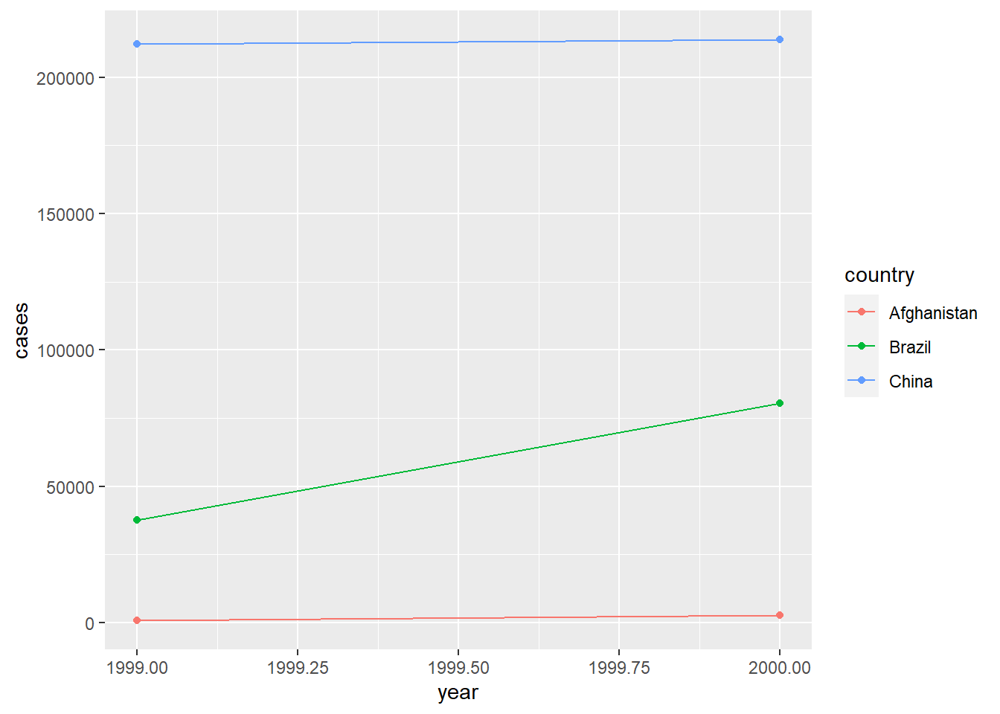

# Tidy data {#tidy-data}


一个好的数据集应该：变量在列中，观察结果在行中，值储存在单元格中；不整洁的数据，我们可以用 tidyr 包中的 pivot_longer() 和 pivot_wider() 辅助修正


```r
library(tidyverse)
```

## 对 table1 数据分析
table1 数据集中 cases 为增长人数（单位：万）。这份数据展现得很不错，我们可以轻松绘制想要的图像。


```r
table1
#> # A tibble: 6 x 4
#>   country      year  cases population
#>   <chr>       <int>  <int>      <int>
#> 1 Afghanistan  1999    745   19987071
#> 2 Afghanistan  2000   2666   20595360
#> 3 Brazil       1999  37737  172006362
#> 4 Brazil       2000  80488  174504898
#> 5 China        1999 212258 1272915272
#> 6 China        2000 213766 1280428583
ggplot(table1, aes(year, cases)) +
    geom_line(aes(group = country, colour = country)) +
    geom_point(aes(colour = country))
```



## 对 table2 数据整理
行中不应该出现将 cases 和 population 放在一起的现象。它们应该作为筛选变量，方便后续对 “新增” “目前总人数” 这个两个变量进行分析，即 type 拆分为列，count 跟随到新列：


```r
table2
#> # A tibble: 12 x 4
#>    country      year type            count
#>    <chr>       <int> <chr>           <int>
#>  1 Afghanistan  1999 cases             745
#>  2 Afghanistan  1999 population   19987071
#>  3 Afghanistan  2000 cases            2666
#>  4 Afghanistan  2000 population   20595360
#>  5 Brazil       1999 cases           37737
#>  6 Brazil       1999 population  172006362
#>  7 Brazil       2000 cases           80488
#>  8 Brazil       2000 population  174504898
#>  9 China        1999 cases          212258
#> 10 China        1999 population 1272915272
#> 11 China        2000 cases          213766
#> 12 China        2000 population 1280428583
table2 %>%
    pivot_wider(names_from = type, values_from = count)
#> # A tibble: 6 x 4
#>   country      year  cases population
#>   <chr>       <int>  <int>      <int>
#> 1 Afghanistan  1999    745   19987071
#> 2 Afghanistan  2000   2666   20595360
#> 3 Brazil       1999  37737  172006362
#> 4 Brazil       2000  80488  174504898
#> 5 China        1999 212258 1272915272
#> 6 China        2000 213766 1280428583
```

## 对 table3 数据整理

行中不应该出现将 cases 和 population 放在一起的现象，需要手动拆分：


```r
table3
#> # A tibble: 6 x 3
#>   country      year rate             
#> * <chr>       <int> <chr>            
#> 1 Afghanistan  1999 745/19987071     
#> 2 Afghanistan  2000 2666/20595360    
#> 3 Brazil       1999 37737/172006362  
#> 4 Brazil       2000 80488/174504898  
#> 5 China        1999 212258/1272915272
#> 6 China        2000 213766/1280428583
# 默认情况下，将在看到非字母数字字符（即不是数字或字母的字符）的位置拆分值
table3 %>%
    separate(rate, into = c("cases", "population"))
#> # A tibble: 6 x 4
#>   country      year cases  population
#>   <chr>       <int> <chr>  <chr>     
#> 1 Afghanistan  1999 745    19987071  
#> 2 Afghanistan  2000 2666   20595360  
#> 3 Brazil       1999 37737  172006362 
#> 4 Brazil       2000 80488  174504898 
#> 5 China        1999 212258 1272915272
#> 6 China        2000 213766 1280428583
# convert 可以自动将数据的格式进行转化。如这里的 cases 和 population 都应该是 int 类型数据
table3 %>%
    separate(rate, into = c("cases", "population"), convert = TRUE)
#> # A tibble: 6 x 4
#>   country      year  cases population
#>   <chr>       <int>  <int>      <int>
#> 1 Afghanistan  1999    745   19987071
#> 2 Afghanistan  2000   2666   20595360
#> 3 Brazil       1999  37737  172006362
#> 4 Brazil       2000  80488  174504898
#> 5 China        1999 212258 1272915272
#> 6 China        2000 213766 1280428583
# 分隔符也可以手动设置
table3 %>%
    separate(rate, into = c("cases", "population"), sep = "/")
#> # A tibble: 6 x 4
#>   country      year cases  population
#>   <chr>       <int> <chr>  <chr>     
#> 1 Afghanistan  1999 745    19987071  
#> 2 Afghanistan  2000 2666   20595360  
#> 3 Brazil       1999 37737  172006362 
#> 4 Brazil       2000 80488  174504898 
#> 5 China        1999 212258 1272915272
#> 6 China        2000 213766 1280428583
# 设置为数字表示分割位置，如这里分割为世纪 + 两位数年
table3 %>%
    separate(year, into = c("century", "year"), sep = 2)
#> # A tibble: 6 x 4
#>   country     century year  rate             
#>   <chr>       <chr>   <chr> <chr>            
#> 1 Afghanistan 19      99    745/19987071     
#> 2 Afghanistan 20      00    2666/20595360    
#> 3 Brazil      19      99    37737/172006362  
#> 4 Brazil      20      00    80488/174504898  
#> 5 China       19      99    212258/1272915272
#> 6 China       20      00    213766/1280428583
```

## 对 table4a & table4b 数据整理
列中不应该出现将 1999 和 2000 分开的现象。它们应该作为筛选变量，方便后续对 “年份” 这个总变量进行分析，即旧变量合并为 year，值合并为 cases：


```r
table4a_new <- table4a %>%
    pivot_longer(
        c(`1999`, `2000`), # 指定修改列。注意这里变量是以数字开头，所以有必要用 `` 引用（当然数字开头是不规范的）
        names_to = "year", # 上述变量名汇总到 year 上
        values_to = "cases" # 上述对应数值汇总到 cases 上
    )
table4b_new <- table4b %>%
    pivot_longer(
        c(`1999`, `2000`),
        names_to = "year",
        values_to = "population"
    )
# 最后合并两个表的数据内容
#* dplyr::left_join()
left_join(table4a_new, table4b_new)
#> Joining, by = c("country", "year")
#> # A tibble: 6 x 4
#>   country     year   cases population
#>   <chr>       <chr>  <int>      <int>
#> 1 Afghanistan 1999     745   19987071
#> 2 Afghanistan 2000    2666   20595360
#> 3 Brazil      1999   37737  172006362
#> 4 Brazil      2000   80488  174504898
#> 5 China       1999  212258 1272915272
#> 6 China       2000  213766 1280428583
```

## 对 table5 数据整理

我们需要手动拆分 cases 和 population 同时要将年份数据进行合并：


```r
table5 %>%
    # 注意如果不声明 sep，默认加间隔符号 “_”！
    unite(year_4cs, century, year, sep = "", na.rm = TRUE) %>%
    separate(rate, into = c("cases", "population"), sep = "/")
#> # A tibble: 6 x 4
#>   country     year_4cs cases  population
#>   <chr>       <chr>    <chr>  <chr>     
#> 1 Afghanistan 1999     745    19987071  
#> 2 Afghanistan 2000     2666   20595360  
#> 3 Brazil      1999     37737  172006362 
#> 4 Brazil      2000     80488  174504898 
#> 5 China       1999     212258 1272915272
#> 6 China       2000     213766 1280428583
```

## 对 stocks 和 treatment 的缺失数据处理


```r
stocks <- tibble(
    year   = c(2015, 2015, 2015, 2015, 2016, 2016, 2016),
    qtr    = c(1, 2, 3, 4, 2, 3, 4),
    return = c(1.88, 0.59, 0.35, NA, 0.92, 0.17, 2.66)
)
new_stocks <- stocks %>%
    # 拆分成按年作列
    pivot_wider(names_from = year, values_from = return) %>%
    # 重新整理回去。注意表格是怎么整理的
    pivot_longer(
        cols = c(`2015`, `2016`),
        names_to = "year",
        values_to = "return",
        values_drop_na = TRUE # 这会对含 NA 的数据行剔除隐藏
    ) %>%
    print()
#> # A tibble: 6 x 3
#>     qtr year  return
#>   <dbl> <chr>  <dbl>
#> 1     1 2015    1.88
#> 2     2 2015    0.59
#> 3     2 2016    0.92
#> 4     3 2015    0.35
#> 5     3 2016    0.17
#> 6     4 2016    2.66
new_stocks %>%
    complete(year, qtr) # 这会把所有隐藏的 NA 数据重新找回
#> # A tibble: 8 x 3
#>   year    qtr return
#>   <chr> <dbl>  <dbl>
#> 1 2015      1   1.88
#> 2 2015      2   0.59
#> 3 2015      3   0.35
#> 4 2015      4  NA   
#> 5 2016      1  NA   
#> 6 2016      2   0.92
#> 7 2016      3   0.17
#> 8 2016      4   2.66

treatment <- tribble(
    ~person, ~treatment, ~response,
    "Derrick Whitmore", 1, 7,
    NA, 2, 10,
    NA, 3, 9,
    "Katherine Burke", 1, 4
)
treatment %>%
    fill(person) # 对 treatment 的 person 列进行补全处理，碰到 NA 时会将 NA 改为上一个不是 NA 的数据
#> # A tibble: 4 x 3
#>   person           treatment response
#>   <chr>                <dbl>    <dbl>
#> 1 Derrick Whitmore         1        7
#> 2 Derrick Whitmore         2       10
#> 3 Derrick Whitmore         3        9
#> 4 Katherine Burke          1        4
```

## 对 who 数据整理
who 是一个流行病统计数据集。


```r
who
#> # A tibble: 7,240 x 60
#>    country  iso2  iso3   year new_sp_m014 new_sp_m1524 new_sp_m2534 new_sp_m3544
#>    <chr>    <chr> <chr> <int>       <int>        <int>        <int>        <int>
#>  1 Afghani~ AF    AFG    1980          NA           NA           NA           NA
#>  2 Afghani~ AF    AFG    1981          NA           NA           NA           NA
#>  3 Afghani~ AF    AFG    1982          NA           NA           NA           NA
#>  4 Afghani~ AF    AFG    1983          NA           NA           NA           NA
#>  5 Afghani~ AF    AFG    1984          NA           NA           NA           NA
#>  6 Afghani~ AF    AFG    1985          NA           NA           NA           NA
#>  7 Afghani~ AF    AFG    1986          NA           NA           NA           NA
#>  8 Afghani~ AF    AFG    1987          NA           NA           NA           NA
#>  9 Afghani~ AF    AFG    1988          NA           NA           NA           NA
#> 10 Afghani~ AF    AFG    1989          NA           NA           NA           NA
#> # ... with 7,230 more rows, and 52 more variables: new_sp_m4554 <int>,
#> #   new_sp_m5564 <int>, new_sp_m65 <int>, new_sp_f014 <int>,
#> #   new_sp_f1524 <int>, new_sp_f2534 <int>, new_sp_f3544 <int>,
#> #   new_sp_f4554 <int>, new_sp_f5564 <int>, new_sp_f65 <int>,
#> #   new_sn_m014 <int>, new_sn_m1524 <int>, new_sn_m2534 <int>,
#> #   new_sn_m3544 <int>, new_sn_m4554 <int>, new_sn_m5564 <int>,
#> #   new_sn_m65 <int>, new_sn_f014 <int>, new_sn_f1524 <int>, ...
who1 <- who %>%
    pivot_longer(
        cols = new_sp_m014:newrel_f65, # 将病症的种类转换成变量（key）
        names_to = "key",
        values_to = "cases", # 将数据转换成 cases 列
        values_drop_na = TRUE # 删除 NA 数据
    )
who1
#> # A tibble: 76,046 x 6
#>    country     iso2  iso3   year key          cases
#>    <chr>       <chr> <chr> <int> <chr>        <int>
#>  1 Afghanistan AF    AFG    1997 new_sp_m014      0
#>  2 Afghanistan AF    AFG    1997 new_sp_m1524    10
#>  3 Afghanistan AF    AFG    1997 new_sp_m2534     6
#>  4 Afghanistan AF    AFG    1997 new_sp_m3544     3
#>  5 Afghanistan AF    AFG    1997 new_sp_m4554     5
#>  6 Afghanistan AF    AFG    1997 new_sp_m5564     2
#>  7 Afghanistan AF    AFG    1997 new_sp_m65       0
#>  8 Afghanistan AF    AFG    1997 new_sp_f014      5
#>  9 Afghanistan AF    AFG    1997 new_sp_f1524    38
#> 10 Afghanistan AF    AFG    1997 new_sp_f2534    36
#> # ... with 76,036 more rows
count(who1, key, sort = TRUE) # 对不同病症人数统计
#> # A tibble: 56 x 2
#>    key              n
#>    <chr>        <int>
#>  1 new_sp_m4554  3223
#>  2 new_sp_m3544  3219
#>  3 new_sp_m5564  3218
#>  4 new_sp_m1524  3209
#>  5 new_sp_m65    3209
#>  6 new_sp_m2534  3206
#>  7 new_sp_f4554  3204
#>  8 new_sp_f2534  3200
#>  9 new_sp_f3544  3199
#> 10 new_sp_f65    3197
#> # ... with 46 more rows
```

对病症名称进行分析得知：

- 前三个字母：是否包含新的或旧的结核病例
- 中间两个字母：结核病的类型

  - rel：复发病例
  - ep：肺外结核病例
  - sn：无法通过肺涂片诊断的肺结核病例（涂片阴性）
  - sp：可通过肺涂片诊断的肺结核病例（涂片阳性）

- 第六个字母：结核病患者的性别。其中 m 为男性，f 为女性
- 最后的数字：年龄组

  - 014：0 ~ 14 岁
  - 1524：15 ~ 24 岁
  - 2534：25 ~ 34 岁
  - 3544：35 ~ 44 岁
  - 4554：45 ~ 54 岁
  - 5564：55 ~ 64岁
  - 65：65 岁或以上


```r
who2 <- who1 %>%
    # 使用 stringr 的 str_replace 可以进行简单的替换（当然切割时使用位置切割也可以）
    mutate(key = stringr::str_replace(key, "newrel", "new_rel")) %>%
    # 通过字符串 “_” 分割为是否包含新病例、结核病类型和性别年龄
    separate(key, c("new", "type", "sexage"), sep = "_") %>%
    # 通过位置继续分割性别和年龄
    separate(sexage, c("sex", "age"), sep = 1)
who2
#> # A tibble: 76,046 x 9
#>    country     iso2  iso3   year new   type  sex   age   cases
#>    <chr>       <chr> <chr> <int> <chr> <chr> <chr> <chr> <int>
#>  1 Afghanistan AF    AFG    1997 new   sp    m     014       0
#>  2 Afghanistan AF    AFG    1997 new   sp    m     1524     10
#>  3 Afghanistan AF    AFG    1997 new   sp    m     2534      6
#>  4 Afghanistan AF    AFG    1997 new   sp    m     3544      3
#>  5 Afghanistan AF    AFG    1997 new   sp    m     4554      5
#>  6 Afghanistan AF    AFG    1997 new   sp    m     5564      2
#>  7 Afghanistan AF    AFG    1997 new   sp    m     65        0
#>  8 Afghanistan AF    AFG    1997 new   sp    f     014       5
#>  9 Afghanistan AF    AFG    1997 new   sp    f     1524     38
#> 10 Afghanistan AF    AFG    1997 new   sp    f     2534     36
#> # ... with 76,036 more rows
```

深度观察，我们会发现数据还有进一步的优化空间：


```r
count(who2, new) # 可以发现这个数据集的 “是否包含新病例” 值其实全部都是 “new”，所以是不必要的数据
#> # A tibble: 1 x 2
#>   new       n
#>   <chr> <int>
#> 1 new   76046
# 同时 “iso2” 和 “iso3” 是国家缩写，也是不需要的数据
who3 <- who2 %>%
    select(-new, -iso2, -iso3)
who3
#> # A tibble: 76,046 x 6
#>    country      year type  sex   age   cases
#>    <chr>       <int> <chr> <chr> <chr> <int>
#>  1 Afghanistan  1997 sp    m     014       0
#>  2 Afghanistan  1997 sp    m     1524     10
#>  3 Afghanistan  1997 sp    m     2534      6
#>  4 Afghanistan  1997 sp    m     3544      3
#>  5 Afghanistan  1997 sp    m     4554      5
#>  6 Afghanistan  1997 sp    m     5564      2
#>  7 Afghanistan  1997 sp    m     65        0
#>  8 Afghanistan  1997 sp    f     014       5
#>  9 Afghanistan  1997 sp    f     1524     38
#> 10 Afghanistan  1997 sp    f     2534     36
#> # ... with 76,036 more rows
```
